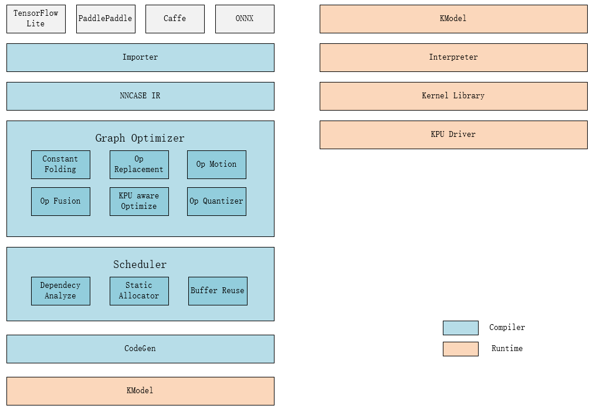

 

`nncase` is a neural network compiler for AI accelerators.

`nncase` 是一个为 AI 加速器设计的神经网络编译器。
技术交流 QQ 群：790699378

## Install from binaries
## 从二进制安装

Download prebuilt binaries from [Release](https://github.com/kendryte/nncase/releases).

下载预编译的二进制文件 [Release](https://github.com/kendryte/nncase/releases)。

## Build from source
## 从源码编译

[Build from source](./docs/build.md)

## Supported operators
## 支持的算子

- [TFLite ops](./docs/tflite_ops.md)
- [Caffe ops](./docs/caffe_ops.md)

## Usage
## 使用方法

- [Usage 使用方法](./docs/USAGE.md)
- [Examples 例子](./examples)

---

## Architecture
## 架构

## Features

- Supports multiple inputs and outputs and multi-branch structure
- Static memory allocation, no heap memory acquired
- Operators fusion and optimizations
- Support float and quantized uint8 inference
- Support post quantization from float model with calibration dataset
- Flat model with zero copy loading

## 功能

- 支持多输入输出网络，支持多分支结构
- 静态内存分配，不需要堆内存
- 算子合并和优化
- 支持 float 和量化 uint8 推理
- 支持训练后量化，使用浮点模型和量化校准集
- 平坦模型，支持零拷贝加载
