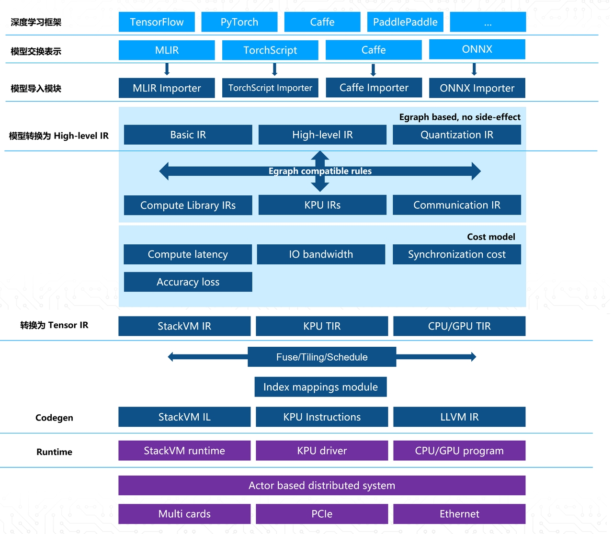

<div align="center">

</div>

[](https://github.com/kendryte/nncase) [](https://gitee.com/kendryte/nncase) [](https://github.com/kendryte/nncase/releases)

[切换中文](docs/readme_ZH.md)

`nncase` is a neural network compiler for AI accelerators.

Telegram: [nncase community](https://t.me/joinchat/PPcEPZMLaTViNDI1)
Technical Discussion QQ Group: 790699378 .   Answer: 人工智能

---

## K230

- [Usage](./docs/USAGE_v2_EN.md)
- [FAQ](./docs/FAQ_EN.md)
- [Example](./examples/user_guide/k230_simulate-EN.ipynb)
- [Colab run](https://colab.research.google.com/drive/1m8TTree096m5VHmq-Uc60gXyltVCgnRb?usp=sharing)
- [ *Version relationship between `nncase` and `K230_SDK`* ](https://developer.canaan-creative.com/k230/dev/zh/03_other/K230_SDK_nncase%E7%89%88%E6%9C%AC%E5%AF%B9%E5%BA%94%E5%85%B3%E7%B3%BB.html#k230sdknncase)
- [update nncase runtime library in SDK](https://developer.canaan-creative.com/k230/dev/zh/03_other/K230_SDK%E6%9B%B4%E6%96%B0nncase%E8%BF%90%E8%A1%8C%E6%97%B6%E5%BA%93%E6%8C%87%E5%8D%97.html)

### Install

- Linux：

    ```shell
    pip install nncase nncase-kpu
    ```

- Windows:

    ```shell
    1. pip install nncase
    2. Download `nncase_kpu-2.x.x-py2.py3-none-win_amd64.whl` in below link.
    3. pip install nncase_kpu-2.x.x-py2.py3-none-win_amd64.whl
    ```

All version of `nncase` and `nncase-kpu` in [Release](https://github.com/kendryte/nncase/releases).


### Supported operators

- [TFLite ops](./docs/tflite_ops.md)
- [Caffe ops](./docs/caffe_ops.md)
- [ONNX ops](./docs/onnx_ops.md)


### benchmark test

<table>
<tr> <th>kind</th> <th> model             </th><th> shape         </th><th> quant_type(If/W) </th><th> nncase_fps    </th><th> tflite_onnx_result    </th><th> accuracy </th><th> info  </th></tr>
<tr>
<td rowspan='3'>Image Classification</td>
<td>mobilenetv2        </td><td> [1,224,224,3] </td><td> u8/u8            </td><td> 600.24        </td><td>  top-1 = 71.3%<br/>top-5 = 90.1%  </td><td> top-1 = 71.1%<br/>top-5 = 90.0% </td><td> dataset(ImageNet 2012, 50000 images)<br/> tflite </td></tr>
<tr><td>resnet50V2         </td><td> [1,3,224,224] </td><td> u8/u8            </td><td> 86.17         </td><td>  top-1 = 75.44%<br/>top-5 = 92.56%  </td><td> top-1 = 75.11% <br/> top-5 = 92.36% </td><td> dataset(ImageNet 2012, 50000 images)<br/> onnx</td></tr>
<tr><td>yolov8s_cls        </td><td> [1,3,224,224] </td><td> u8/u8            </td><td> 130.497       </td><td>  top-1 = 72.2%<br/>top-5 = 90.9% </td><td> top-1 = 72.2%<br/>top-5 = 90.8% </td><td> dataset(ImageNet 2012, 50000 images)<br/> yolov8s_cls(v8.0.207)</td></tr>
<tr>
<td rowspan='2'>Object Detection</td>
<td>yolov5s_det        </td><td> [1,3,640,640] </td><td> u8/u8            </td><td> 23.645        </td><td>  bbox<br/>mAP50-90 = 0.374<br/>mAP50 = 0.567  </td><td> bbox<br/>mAP50-90 = 0.369<br/>mAP50 = 0.566</td><td>dataset(coco val2017, 5000 images)<br/>yolov5s_det(v7.0 tag, rect=False, conf=0.001, iou=0.65)</td></tr>
<tr><td>yolov8s_det        </td><td> [1,3,640,640] </td><td> u8/u8            </td><td> 9.373         </td><td>  bbox<br/>mAP50-90 = 0.446<br/>mAP50 = 0.612<br/>mAP75 = 0.484  </td><td> bbox<br/>mAP50-90 = 0.404<br/>mAP50 = 0.593<br/>mAP75 = 0.45</td><td>dataset(coco val2017, 5000 images)<br/>yolov8s_det(v8.0.207, rect = False)</td></tr>
<tr>
<td rowspan='1'>Image Segmentation</td>
<td>yolov8s_seg        </td><td> [1,3,640,640] </td><td> u8/u8            </td><td> 7.845         </td><td>  bbox<br/>mAP50-90 = 0.444<br/>mAP50 = 0.606<br/>mAP75 = 0.484<br/>segm<br/>mAP50-90 = 0.371<br/>mAP50 = 0.578<br/>mAP75 = 0.396       </td><td> bbox<br/>mAP50-90 = 0.444<br/>mAP50 = 0.606<br/>mAP75 = 0.484<br/>segm<br/>mAP50-90 = 0.371<br/>mAP50 = 0.579<br/>mAP75 = 0.397</td><td> dataset(coco val2017, 5000 images)<br/>yolov8s_seg(v8.0.207, rect = False, conf_thres = 0.0008)</td></tr>
<tr>
<td rowspan='3'>Pose Estimation</td>
<td>yolov8n_pose_320   </td><td> [1,3,320,320] </td><td> u8/u8            </td><td> 36.066        </td><td>  bbox<br/>mAP50-90 = 0.6<br/>mAP50 = 0.843<br/>mAP75 = 0.654<br/>keypoints<br/>mAP50-90 = 0.358<br/>mAP50 = 0.646<br/>mAP75 = 0.353    </td><td> bbox<br/>mAP50-90 = 0.6<br/>mAP50 = 0.841<br/>mAP75 = 0.656<br/>keypoints<br/>mAP50-90 = 0.359<br/>mAP50 = 0.648<br/>mAP75 = 0.357 </td><td> dataset(coco val2017, 2346 images)<br/>yolov8n_pose(v8.0.207, rect = False)</td></tr>
<tr><td>yolov8n_pose_640   </td><td> [1,3,640,640] </td><td> u8/u8            </td><td> 10.88         </td><td>  bbox<br/>mAP50-90 = 0.694<br/>mAP50 = 0.909<br/>mAP75 = 0.776<br/>keypoints<br/>mAP50-90 = 0.509<br/>mAP50 = 0.798<br/>mAP75 = 0.544  </td><td> bbox<br/>mAP50-90 = 0.694<br/>mAP50 = 0.909<br/>mAP75 = 0.777<br/>keypoints<br/>mAP50-90 = 0.508<br/>mAP50 = 0.798<br/>mAP75 = 0.54 </td><td> dataset(coco val2017, 2346 images)<br/>yolov8n_pose(v8.0.207, rect = False)</td></tr>
<tr><td>yolov8s_pose       </td><td> [1,3,640,640] </td><td> u8/u8            </td><td> 5.568         </td><td>  bbox<br/>mAP50-90 = 0.733<br/>mAP50 = 0.925<br/>mAP75 = 0.818<br/>keypoints<br/>mAP50-90 = 0.605<br/>mAP50 = 0.857<br/>mAP75 = 0.666  </td><td> bbox<br/>mAP50-90 = 0.734<br/>mAP50 = 0.925<br/>mAP75 = 0.819<br/>keypoints<br/>mAP50-90 = 0.604<br/>mAP50 = 0.859<br/>mAP75 = 0.669</td><td> dataset(coco val2017, 2346 images)<br/>yolov8s_pose(v8.0.207, rect = False)</td></tr>
</table>


### Demo

|[eye gaze](https://developer.canaan-creative.com/modelDetail?id=142)  | [space_resize](https://developer.canaan-creative.com/modelDetail?id=141) | [face pose](https://developer.canaan-creative.com/modelDetail?id=125)|
| --- | --- | --- |
|  | |  |

---

## K210/K510

- [Usage](https://github.com/kendryte/nncase/blob/release/1.0/docs/USAGE_EN.md)
- [FAQ](https://github.com/kendryte/nncase/blob/release/1.0/docs/FAQ_EN.md)
- [Example](https://github.com/kendryte/nncase/blob/release/1.0/examples/user_guide/)

### Supported operators

- [TFLite ops](https://github.com/kendryte/nncase/blob/release/1.0/docs/tflite_ops.md)
- [Caffe ops](https://github.com/kendryte/nncase/blob/release/1.0/docs/caffe_ops.md)
- [ONNX ops](https://github.com/kendryte/nncase/blob/release/1.0/docs/onnx_ops.md)

---

## Features

- Supports multiple inputs and outputs and multi-branch structure
- Static memory allocation, no heap memory acquired
- Operators fusion and optimizations
- Support float and quantized uint8 inference
- Support post quantization from float model with calibration dataset
- Flat model with zero copy loading

---

## Architecture

<div align="center">

</div>

---

## Build from source

**It is recommended to install nncase directly through `pip`. At present, the source code related to k510 and K230 chips is not open source, so it is not possible to use `nncase-K510` and `nncase-kpu` (K230) directly by compiling source code.**


If there are operators in your model that `nncase` does not yet support, you can request them in the issue or implement them yourself and submit the PR. Later versions will be integrated, or contact us to provide a temporary version.
Here are the steps to compile `nncase`.

```shell
git clone https://github.com/kendryte/nncase.git
cd nncase
mkdir build && cd build

# Use Ninja
cmake .. -G Ninja -DCMAKE_BUILD_TYPE=Release -DCMAKE_INSTALL_PREFIX=./install
ninja && ninja install

# Use make
cmake .. -DCMAKE_BUILD_TYPE=Release -DCMAKE_INSTALL_PREFIX=./install
make && make install
```

---

## Resources

### Canaan developer community

[Canaan developer community](https://developer.canaan-creative.com/resource) contains all resources related to K210, K510, and K230.

- 资料下载 --> Pre-compiled images available for the development boards corresponding to the three chips.
- 文档 --> Documents corresponding to the three chips.
- 模型库 --> Examples and code for industrial, security, educational and other scenarios that can be run on the K210 and K230.
- 模型训练 --> The model training platform for K210 and K230 supports the training of various scenarios.

### Bilibili

- [Canaan AI tutorial and application demonstration](https://space.bilibili.com/677429436)


### K210 related repo

- [K210_Yolo_framework](https://github.com/zhen8838/K210_Yolo_framework)
- [Shts!&#39;s Blog (Japanese)](https://www.shtsno24.tokyo/2020/03/nncase-v020.html)
- [Examples](https://github.com/kendryte/canmv_examples/tree/main/01-K210)

### K230 related repo

- C: [K230_SDK](https://github.com/kendryte/k230_sdk)
    - [Documents](https://github.com/kendryte/k230_docs)
    - [K230 end-to-end tutorial](https://github.com/kendryte/K230_training_scripts)
- MicroPython: [Canmv_k230](https://github.com/kendryte/k230_canmv)
    - [Documents](https://github.com/kendryte/k230_canmv_docs)
    - [Examples](https://github.com/kendryte/canmv_examples/tree/main/02-K230)
---
