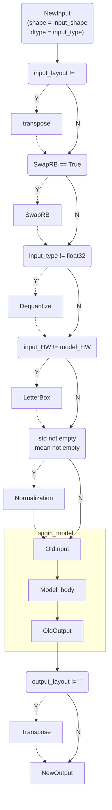
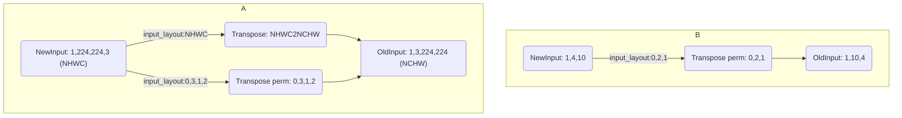
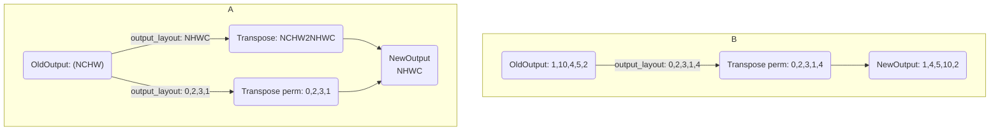

# 概述

nncase仅提供Python APIs, 用于在PC上编译/推理深度学习模型.

# nncase-v2 python APIs

## 安装

nncase工具链compiler部分包括nncase和KPU插件包

- nncase 和KPU插件包均在[nncase github](https://github.com/kendryte/nncase/releases)发布

- V2版本依赖dotnet-7.0

- 可以直接使用pip进行nncase和KPU插件包安装，Ubuntu环境下可使用`apt`安装`dotnet`
  ```
  pip install --upgrade pip
  pip install nncase
  pip install nncase-kpu
  
  # nncase-2.x need dotnet-7
  sudo apt-get install -y dotnet-sdk-7.0
  ```

用户若没有Ubuntu环境, 可使用[nncase docker](https://github.com/kendryte/nncase/blob/master/docs/build.md#docker)(Ubuntu 20.04 + Python 3.8)

```shell
$ cd /path/to/nncase_sdk
$ docker pull registry.cn-hangzhou.aliyuncs.com/kendryte/nncase:latest
$ docker run -it --rm -v `pwd`:/mnt -w /mnt registry.cn-hangzhou.aliyuncs.com/kendryte/nncase:latest /bin/bash -c "/bin/bash"
```

### 查看版本信息

```python
root@469e6a4a9e71:/mnt# python3
Python 3.8.10 (default, May 26 2023, 14:05:08)
[GCC 9.4.0] on linux
Type "help", "copyright", "credits" or "license" for more information.
>>> import _nncase
>>> print(_nncase.__version__)
2.1.0-4a87051
```

## 编译模型和推理示例

k230模型编译推理参考Jupyter脚本：[User_guide](../examples/user_guide/k230_simulate.ipynb)，脚本中包含了单输入和多输入的示例。

在执行脚本之前需要根据自身需求修改以下内容：

1. `compile_kmodel`函数中`compile_options`,`ptq_options`相关信息
   `compile_options`详细信息见[CompileOptions](#CompileOptions),
   `ptq_options`详细信息见[PTQTensorOptions](#PTQTensorOptions)

2. `compile kmodel single input(multiple inputs)`部分

   a. 修改`model_path`和`dump_path`，用于指定模型路径和编译期间文件生成路径。
   b. 修改`calib_data`的实现，数据格式见注释。

3. `run kmodel(simulate)`部分，修改`input_data`的实现，数据格式见注释。

推理结束后，会在`dump_path`路径下生成`kmodel`、输出结果和<u>编译期间的文件`dump_ir==True`</u>

## nncase 编译模型APIs

### CompileOptions

#### 功能描述

CompileOptions类, 用于配置nncase编译选项各属性说明如下

| 属性名称        |    类型     | 是否必须 | 描述                                                         |
| :-------------- | :---------: | :------: | ------------------------------------------------------------ |
| target          |   string    |    是    | 指定编译目标, 如'cpu', 'k230'                                |
| dump_ir         |    bool     |    否    | 指定是否dump IR, 默认为False                                 |
| dump_asm        |    bool     |    否    | 指定是否dump asm汇编文件, 默认为False                        |
| dump_dir        |   string    |    否    | 前面指定dump_ir等开关后, 这里指定dump的目录, 默认为空字符串  |
|                 |             |          |                                                              |
| preprocess      |    bool     |    否    | 是否开启前处理，默认为False                                  |
| input_type      |   string    |    否    | 开启前处理时指定输入数据类型，默认为"float"。当`preprocess`为`True`时，必须指定为"uint8"或者"float32" |
| input_shape     |  list[int]  |    否    | 开启前处理时指定输入数据的shape，默认为[]。当`preprocess`为`True`时，必须指定 |
| input_range     | list[float] |    否    | 开启前处理时指定输入数据反量化后的浮点数范围，默认为[ ]。当`preprocess`为`True`且`input_type`为`uint8`时，必须指定 |
| input_layout    |   string    |    否    | 指定输入数据的layout，默认为" "                              |
| swapRB          |    bool     |    否    | 是否在`channel`维度反转数据，默认为False                     |
| mean            | list[float] |    否    | 前处理标准化参数均值，默认为[0,0,0]                          |
| std             | list[float] |    否    | 前处理标准化参数方差，默认为[1,1,1]                          |
| letterbox_value |    float    |    否    | 指定前处理letterbox的填充值，默认为0                         |
| output_layout   |   string    |    否    | 指定输出数据的layout, 默认为" "                              |

##### 前处理流程说明

目前暂不支持自定义前处理顺序，你可以根据以下流程示意图选择需要的前处理参数进行配置。



参数说明：

 1. `input_range`为输入数据类型为定点时，反量化后的浮点数范围。
    a. 输入数据类型为uint8，range为0~255，`input_range`为0~255，则反量化的作用只是进行类型转化，将uint8的数据转化为float32，`mean`和`std`参数仍然按照0~255的数据进行指定。
    b. 输入数据类型为uint8，range为0~255，`input_range`为0~1，则反量化会将定点数转化为浮点数0~1，`mean`和`std`参数需要按照0~1的数据进行指定。

    ```mermaid
    graph TD;
    	NewInput_uint8("NewInput_uint8 \n[input_type:uint8]") --input_range:0,255 -->dequantize_0["Dequantize"]--float range:0,255--> OldInput_float32
    	NewInput_uint81("NewInput_uint8 \n[input_type:uint8]") --input_range:0,1 -->dequantize_1["Dequantize"]--float range:0,1--> OldInput_float32
    ```

    

 2. `input_shape`为输入数据的shape，layout为`input_layout`，现在支持字符串（`"NHWC"`、`"NCHW"`）和index两种方式作为`input_layout`，并且支持非4D的数据处理。
    当按照字符串形式配置`input_layout`时，表示输入数据的layout；当按照index形式配置`input_layout`时，表示输入数据会按照当前配置的`input_layout`进行数据转置，即`input_layout`为`Transpose`的`perm`参数。



​		`output_layout`同理



#### 代码示例

实例化CompileOptions，配置各属性的值。

```python
compile_options = nncase.CompileOptions()

compile_options.target = "cpu" #"k230"
compile_options.dump_ir = True  # if False, will not dump the compile-time result.
compile_options.dump_asm = True
compile_options.dump_dir = "dump_path"

# preprocess args
compile_options.preprocess = False
if compile_options.preprocess:
    compile_options.input_type = "uint8" # "uint8" "float32"
    compile_options.input_shape = [1,224,320,3]
    compile_options.input_range = [0,1]
    compile_options.input_layout = "NHWC" # "NHWC"
    compile_options.swapRB = False
    compile_options.mean = [0,0,0]
    compile_options.std = [1,1,1]
    compile_options.letterbox_value = 0
    compile_options.output_layout = "NHWC" # "NHWC"
```

### ImportOptions

#### 功能描述

ImportOptions类, 用于配置nncase导入选项，各属性说明如下

| 属性名称      | 类型   | 是否必须 | 描述     |
| ------------- | ------ | -------- | -------- |
| output_arrays | string | 否       | 输出名称 |

#### 代码示例

实例化ImportOptions, 配置各属性的值

```python
# import_options
import_options = nncase.ImportOptions()
import_options.output_arrays = 'output' # Your output node name
```

### PTQTensorOptions

#### 功能描述

PTQTensorOptions类, 用于配置nncase PTQ选项，各属性说明如下

| 字段名称                              | 类型   | 是否必须 | 描述                                                         |
| ------------------------------------- | ------ | -------- | ------------------------------------------------------------ |
| calibrate_method                      | string | 否       | 量化校正方法，默认为'NoClip'，可选'Kld'。使用量化时必须配置  |
| samples_count                         | int    | 否       | 校正集数量。使用量化时必须配置                               |
| finetune_weights_method               | string | 否       | 微调权重方法，默认为'NoFineTuneWeights'。可选 'UseSquant'    |
| quant_type                            | string | 否       | 数据量化类型，默认为'uint8'。可选'int8','int16'              |
| w_quant_type                          | string | 否       | 权重量化类型，默认为'uint8'。可选'int8','int16'              |
|                                       |        |          |                                                              |
| dump_quant_error                      | bool   | 否       | 是否生成量化损失，默认为False。在`dump_ir=True`时生效        |
| dump_quant_error_symmetric_for_signed | bool   | 否       | 是否生成使用范围对称的量化损失，默认为True。在`dump_ir=True`时生效 |
| quant_scheme                          | string | 否       | 量化配置文件路径，默认为“ ”。在`dump_ir=True`时生效          |
| export_quant_scheme                   | bool   | 否       | 是否导出量化配置文件，默认为False。在`dump_ir=True`时生效    |
| export_weight_range_by_channel        | bool   | 否       | 导出量化配置文件时，是否按照channel统计权重的范围，默认为False。在`dump_ir=True`时生效 |

量化配置文件相关详细信息见[Mix Quant](MixQuant.md)

#### set_tensor_data()

##### 功能描述

设置校正数据

##### 接口定义

```python
set_tensor_data(calib_data)
```

##### 输入参数

| 参数名称   | 类型                   | 是否必须 | 描述     |
| ---------- | ---------------------- | -------- | -------- |
| calib_data | List[List[np.ndarray]] | 是       | 校正数据 |

##### 返回值

N/A

##### 代码示例

```python
# If model has multiple inputs, calib_data format is "[[x1, x2,...], [y1, y2,...], ...]"
# e.g. Model has three inputs (x, y, z), the calib_data is '[[x1, x2, x3],[y1, y2, y3],[z1, z2, z3]]'

calib_data = [[np.random.rand(1, 3, 224, 224).astype(np.float32), np.random.rand(1, 3, 224, 224).astype(np.float32)]]

# ptq_options
ptq_options = nncase.PTQTensorOptions()
ptq_options.samples_count = len(calib_data[0])
ptq_options.set_tensor_data(calib_data)
```

### Compiler

#### 功能描述

Compiler类, 用于编译神经网络模型

#### 代码示例

```python
compiler = nncase.Compiler(compile_options)
```

#### import_tflite()

##### 功能描述

导入tflite模型

##### 接口定义

```python
import_tflite(model_content, import_options)
```

##### 输入参数

| 参数名称       | 类型          | 是否必须 | 描述           |
| -------------- | ------------- | -------- | -------------- |
| model_content  | byte[]        | 是       | 读取的模型内容 |
| import_options | ImportOptions | 是       | 导入选项       |

##### 返回值

N/A

##### 代码示例

```python
model_content = read_model_file(model)
compiler.import_tflite(model_content, import_options)
```

#### import_onnx()

##### 功能描述

导入onnx模型

##### 接口定义

```python
import_onnx(model_content, import_options)
```

##### 输入参数

| 参数名称       | 类型          | 是否必须 | 描述           |
| -------------- | ------------- | -------- | -------------- |
| model_content  | byte[]        | 是       | 读取的模型内容 |
| import_options | ImportOptions | 是       | 导入选项       |

##### 返回值

N/A

##### 代码示例

```python
model_content = read_model_file(model)
compiler.import_onnx(model_content, import_options)
```

#### use_ptq()

##### 功能描述

设置PTQ配置选项

##### 接口定义

```python
use_ptq(ptq_options)
```

##### 输入参数

| 参数名称    | 类型             | 是否必须 | 描述        |
| ----------- | ---------------- | -------- | ----------- |
| ptq_options | PTQTensorOptions | 是       | PTQ配置选项 |

##### 返回值

N/A

##### 代码示例

```python
compiler.use_ptq(ptq_options)
```

#### compile()

##### 功能描述

编译神经网络模型

##### 接口定义

```python
compile()
```

##### 输入参数

N/A

##### 返回值

N/A

##### 代码示例

```python
compiler.compile()
```

#### gencode_tobytes()

##### 功能描述

生成代码字节流

##### 接口定义

```python
gencode_tobytes()
```

##### 输入参数

N/A

##### 返回值

bytes[]

##### 代码示例

```python
kmodel = compiler.gencode_tobytes()
with open(os.path.join(infer_dir, 'test.kmodel'), 'wb') as f:
    f.write(kmodel)
```


## nncase 推理模型APIs

除了编译模型APIs, nncase还提供了推理模型的APIs, 在PC上可推理前面编译生成的kmodel,  用来验证nncase推理结果和相应深度学习框架的runtime的结果是否一致等.

### MemoryRange

#### 功能描述

MemoryRange类, 用于表示内存范围，各属性说明如下

| 属性名称 | 类型           | 是否必须 | 描述                                                         |
| -------- | -------------- | -------- | ------------------------------------------------------------ |
| location | int            | 否       | 内存位置, 0表示input, 1表示output, 2表示rdata, 3表示data, 4表示shared_data |
| dtype    | python数据类型 | 否       | 数据类型                                                     |
| start    | int            | 否       | 内存起始地址                                                 |
| size     | int            | 否       | 内存大小                                                     |

#### 代码示例

实例化MemoryRange

```python
mr = nncase.MemoryRange()
```

### RuntimeTensor

#### 功能描述

RuntimeTensor类, 用于表示运行时tensor，各属性说明如下

| 属性名称 | 类型 | 是否必须 | 描述             |
| -------- | ---- | -------- | ---------------- |
| dtype    | int  | 否       | tensor的数据类型 |
| shape    | list | 否       | tensor的形状     |

#### from_numpy()

##### 功能描述

从numpy.ndarray构造RuntimeTensor对象

##### 接口定义

```python
from_numpy(py::array arr)
```

##### 输入参数

| 参数名称 | 类型          | 是否必须 | 描述              |
| -------- | ------------- | -------- | ----------------- |
| arr      | numpy.ndarray | 是       | numpy.ndarray对象 |

##### 返回值

RuntimeTensor

##### 代码示例

```python
data = np.random.rand(1, 3, 224, 224).astype(np.float32)
tensor = nncase.RuntimeTensor.from_numpy(data)
```

#### copy_to()

##### 功能描述

拷贝RuntimeTensor

##### 接口定义

```python
copy_to(RuntimeTensor to)
```

##### 输入参数

| 参数名称 | 类型          | 是否必须 | 描述              |
| -------- | ------------- | -------- | ----------------- |
| to       | RuntimeTensor | 是       | RuntimeTensor对象 |

##### 返回值

N/A

##### 代码示例

```python
sim.get_output_tensor(i).copy_to(to)
```

#### to_numpy()

##### 功能描述

将RuntimeTensor转换为numpy.ndarray对象

##### 接口定义

```python
to_numpy()
```

##### 输入参数

N/A

##### 返回值

numpy.ndarray对象

##### 代码示例

```python
arr = sim.get_output_tensor(i).to_numpy()
```

### Simulator

#### 功能描述

Simulator类, 用于在PC上推理kmodel，各属性说明如下

| 属性名称     | 类型 | 是否必须 | 描述     |
| ------------ | ---- | -------- | -------- |
| inputs_size  | int  | 否       | 输入个数 |
| outputs_size | int  | 否       | 输出个数 |

#### 代码示例

实例化Simulator

```python
sim = nncase.Simulator()
```

#### load_model()

##### 功能描述

加载kmodel

##### 接口定义

```python
load_model(model_content)
```

##### 输入参数

| 参数名称      | 类型   | 是否必须 | 描述         |
| ------------- | ------ | -------- | ------------ |
| model_content | byte[] | 是       | kmodel字节流 |

##### 返回值

N/A

##### 代码示例

```python
sim.load_model(kmodel)
```

#### get_input_desc()

##### 功能描述

获取指定索引的输入的描述信息

##### 接口定义

```python
get_input_desc(index)
```

##### 输入参数

| 参数名称 | 类型 | 是否必须 | 描述       |
| -------- | ---- | -------- | ---------- |
| index    | int  | 是       | 输入的索引 |

##### 返回值

MemoryRange

##### 代码示例

```python
input_desc_0 = sim.get_input_desc(0)
```

#### get_output_desc()

##### 功能描述

获取指定索引的输出的描述信息

##### 接口定义

```python
get_output_desc(index)
```

##### 输入参数

| 参数名称 | 类型 | 是否必须 | 描述       |
| -------- | ---- | -------- | ---------- |
| index    | int  | 是       | 输出的索引 |

##### 返回值

MemoryRange

##### 代码示例

```python
output_desc_0 = sim.get_output_desc(0)
```

#### get_input_tensor()

##### 功能描述

获取指定索引的输入的RuntimeTensor

##### 接口定义

```python
get_input_tensor(index)
```

##### 输入参数

| 参数名称 | 类型 | 是否必须 | 描述             |
| -------- | ---- | -------- | ---------------- |
| index    | int  | 是       | 输入tensor的索引 |

##### 返回值

RuntimeTensor

##### 代码示例

```python
input_tensor_0 = sim.get_input_tensor(0)
```

#### set_input_tensor()

##### 功能描述

设置指定索引的输入的RuntimeTensor

##### 接口定义

```python
set_input_tensor(index, tensor)
```

##### 输入参数

| 参数名称 | 类型          | 是否必须 | 描述                    |
| -------- | ------------- | -------- | ----------------------- |
| index    | int           | 是       | 输入RuntimeTensor的索引 |
| tensor   | RuntimeTensor | 是       | 输入RuntimeTensor       |

##### 返回值

N/A

##### 代码示例

```python
data = [np.random.rand(1, 3, 224, 224).astype(np.float32)]
sim.set_input_tensor(0, nncase.RuntimeTensor.from_numpy(data[0]))
```

#### get_output_tensor()

##### 功能描述

获取指定索引的输出的RuntimeTensor

##### 接口定义

```python
get_output_tensor(index)
```

##### 输入参数

| 参数名称 | 类型 | 是否必须 | 描述                    |
| -------- | ---- | -------- | ----------------------- |
| index    | int  | 是       | 输出RuntimeTensor的索引 |

##### 返回值

RuntimeTensor

##### 代码示例

```python
output_arr_0 = sim.get_output_tensor(0).to_numpy()
```

#### set_output_tensor()

##### 功能描述

设置指定索引的输出的RuntimeTensor

##### 接口定义

```python
set_output_tensor(index, tensor)
```

##### 输入参数

| 参数名称 | 类型          | 是否必须 | 描述                    |
| -------- | ------------- | -------- | ----------------------- |
| index    | int           | 是       | 输出RuntimeTensor的索引 |
| tensor   | RuntimeTensor | 是       | 输出RuntimeTensor       |

##### 返回值

N/A

##### 代码示例

```python
sim.set_output_tensor(0, tensor)
```

#### run()

##### 功能描述

运行kmodel推理

##### 接口定义

```python
run()
```

##### 输入参数

N/A

##### 返回值

N/A

##### 代码示例

```python
sim.run()
```

