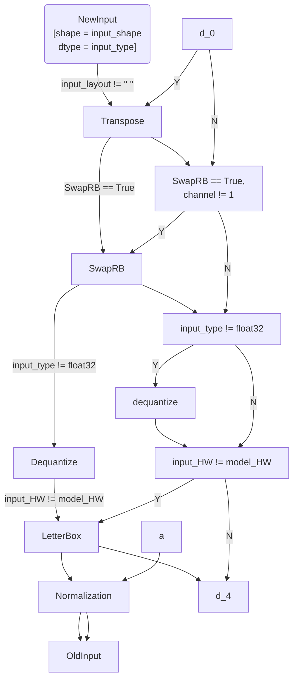
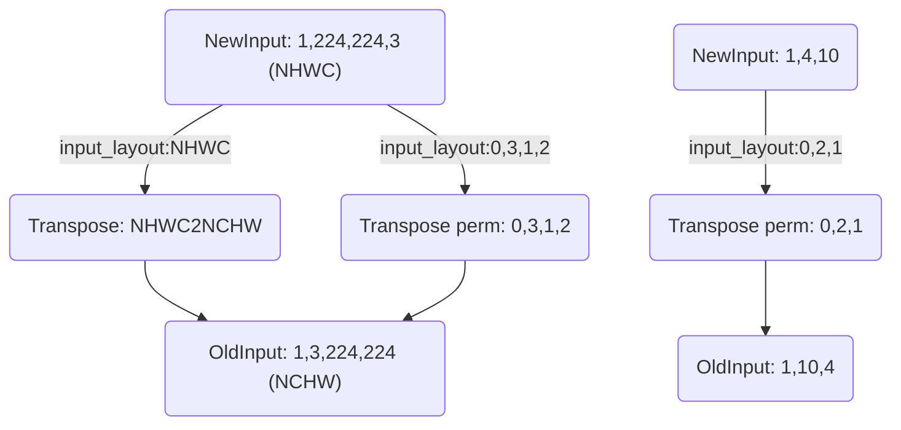
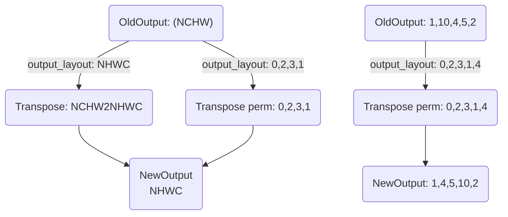

# 概述

nncase目前提供了python wheel编译模型.

- nncase wheel包需要去[nncase release](https://github.com/kendryte/nncase/releases)获取

# nncase-v2 python APIs

nncase提供了Python APIs, 用于在PC上编译/推理深度学习模型.

## 安装

nncase工具链compiler部分包括nncase和KPU插件包

- nncase 和KPU插件包均在[nncase github](https://github.com/kendryte/nncase/releases)发布

- V2版本依赖dotnet-7.0

- 可以直接使用pip进行nncase和KPU插件包安装，Ubuntu环境下可使用`apt`安装`dotnet`
  ```
  pip install --upgrade pip
  pip install nncase
  pip install nncase-kpu
  
  # nncase-2.x need dotnet-7
  sudo apt-get install -y dotnet-sdk-7.0
  ```

用户若没有Ubuntu环境, 可使用[nncase docker](https://github.com/kendryte/nncase/blob/master/docs/build.md#docker)(Ubuntu 20.04 + Python 3.8)

```shell
$ cd /path/to/nncase_sdk
$ docker pull registry.cn-hangzhou.aliyuncs.com/kendryte/nncase:latest
$ docker run -it --rm -v `pwd`:/mnt -w /mnt registry.cn-hangzhou.aliyuncs.com/kendryte/nncase:latest /bin/bash -c "/bin/bash"
```

### 查看版本信息

```python
root@469e6a4a9e71:/mnt# python3
Python 3.8.10 (default, Jun  2 2021, 10:49:15)
[GCC 9.4.0] on linux
Type "help", "copyright", "credits" or "license" for more information.
>>> import _nncase
>>> print(_nncase.__version__)
2.1.0-4a87051
```

## nncase 编译模型APIs

### CompileOptions

#### 功能描述

CompileOptions类, 用于配置nncase编译选项各属性说明如下

| 属性名称        |    类型     | 是否必须 | 描述                                                         |
| :-------------- | :---------: | :------: | ------------------------------------------------------------ |
| target          |   string    |    是    | 指定编译目标, 如'cpu', 'k230'                                |
| dump_ir         |    bool     |    否    | 指定是否dump IR, 默认为False                                 |
| dump_asm        |    bool     |    否    | 指定是否dump asm汇编文件, 默认为False                        |
| dump_dir        |   string    |    否    | 前面指定dump_ir等开关后, 这里指定dump的目录, 默认为空字符串  |
|                 |             |          |                                                              |
| preprocess      |    bool     |    否    | 是否开启前处理，默认为False                                  |
| input_type      |   string    |    否    | 指定输入数据类型，默认为"float"                              |
| input_shape     |  list[int]  |    否    | 指定输入数据的shape，input_shape的layout需要与input layout保持一致，输入数据的input_shape与模型的input shape不一致时会进行letterbox操作(resize/pad等) |
| input_range     | list[float] |    否    | 输入数据反量化后对应浮点数的范围，默认为[0，1]               |
| input_layout    |   string    |    否    | 指定输入数据的layout，现在可以用两种方式指定layout，详见后文 |
| swapRB          |    bool     |    否    | 是否在`channel`维度反转数据，默认为False                     |
| mean            | list[float] |    否    | 前处理标准化参数均值，默认为[0, 0, 0]                        |
| std             | list[float] |    否    | 前处理标准化参数方差，默认为[1, 1, 1]                        |
| letterbox_value |    float    |    否    | 指定前处理letterbox的填充值                                  |
| output_layout   |   string    |    否    | 指定输出数据的layout, 如'NCHW', 'NHWC'. 若输出数据layout与模型本身layout不同, nncase会插入transpose进行转换 |

前处理流程：




参数说明：

 1. input range为输入数据类型为定点时，反量化后的浮点数范围。
    ```mermaid
    graph TD;
    	newInput_uint8("newInput_uint8 \n[input_type:uint8]") --input_range:0,255 -->dequant0--float range:0,255--> oldInput_float32
    	newInput_uint81("newInput_uint8 \n[input_type:uint8]") --input_range:0,1 -->dequant1--float range:0,1--> oldInput_float32
    ```

    

 2. input_shape需要按照input_layout进行指定，以[1，224，224，3]为例，如果input_layout为NCHW，则input_shape需指定为[1,3,224,224];input_layout为NHWC，则input_shape需指定为[1,224,224,3];

 例如:

 1. 输入数据类型为uint8，range为0~255，input_range为0~255，则反量化的作用只是进行类型转化，将uint8的数据转化为float32，mean和std参数仍然可以按照0~255的数据进行指定.
 2. 输入数据类型为uint8，range为0~255，input_range为0~1，则反量化会将定点数转化为浮点数0~1，mean和std参数需要按照0~1的数据进行指定。







```mermaid

```


#### 代码示例

实例化CompileOptions，配置各属性的值，

```python
compile_options = nncase.CompileOptions()

compile_options.target = "cpu" #"k230"
compile_options.dump_ir = True  # if False, will not dump the compile-time result.
compile_options.dump_asm = True
compile_options.dump_dir = "dump_path"

# preprocess args
compile_options.preprocess = False
if compile_options.preprocess:
    compile_options.input_type = "uint8" # "uint8" "float32"
    compile_options.input_shape = [1,224,320,3]
    compile_options.input_range = [0,1]
    compile_options.input_layout = "NHWC" # "NHWC"
    compile_options.swapRB = False
    compile_options.mean = [0,0,0]
    compile_options.std = [1,1,1]
    compile_options.letterbox_value = 0
    compile_options.output_layout = "NHWC" # "NHWC"
```

### ImportOptions

#### 功能描述

ImportOptions类, 用于配置nncase导入选项

#### 类定义

```python
py::class_<import_options>(m, "ImportOptions")
    .def(py::init())
    .def_readwrite("output_arrays", &import_options::output_arrays);
```

各属性说明如下

| 属性名称      | 类型   | 是否必须 | 描述     |
| ------------- | ------ | -------- | -------- |
| output_arrays | string | 否       | 输出名称 |

#### 代码示例

实例化ImportOptions, 配置各属性的值

```python
# import_options
import_options = nncase.ImportOptions()
import_options.output_arrays = 'output' # Your output node name
```

### PTQTensorOptions

#### 功能描述

PTQTensorOptions类, 用于配置nncase PTQ选项

#### 类定义

```python
py::class_<ptq_tensor_options>(m, "PTQTensorOptions")
    .def(py::init())
    .def_readwrite("calibrate_method", &ptq_tensor_options::calibrate_method)
    .def_readwrite("samples_count", &ptq_tensor_options::samples_count)
    .def("set_tensor_data", [](ptq_tensor_options &o, py::bytes bytes) {
        uint8_t *buffer;
        py::ssize_t length;
        if (PyBytes_AsStringAndSize(bytes.ptr(), reinterpret_cast<char **>(&buffer), &length))
            throw std::invalid_argument("Invalid bytes");
        o.tensor_data.assign(buffer, buffer + length);
    });
```

各属性说明如下

| 字段名称         | 类型   | 是否必须 | 描述                                                         |
| ---------------- | ------ | -------- | ------------------------------------------------------------ |
| calibrate_method | string | 否       | 校准方法 ,  支持'no_clip', 'l2', 'kld_m0', 'kld_m1', 'kld_m2', 'cdf', 默认是'no_clip' |
| samples_count    | int    | 否       | 样本个数                                                     |

#### set_tensor_data()

##### 功能描述

设置校正数据

##### 接口定义

```python
set_tensor_data(calib_data)
```

##### 输入参数

| 参数名称   | 类型   | 是否必须 | 描述     |
| ---------- | ------ | -------- | -------- |
| calib_data | byte[] | 是       | 校正数据 |

##### 返回值

N/A

##### 代码示例

```python
# ptq_options
ptq_options = nncase.PTQTensorOptions()
ptq_options.samples_count = cfg.generate_calibs.batch_size
ptq_options.set_tensor_data(np.asarray([sample['data'] for sample in self.calibs]).tobytes())
```

### Compiler

#### 功能描述

Compiler类, 用于编译神经网络模型

#### 类定义

```python
py::class_<compiler>(m, "Compiler")
    .def(py::init(&compiler::create))
    .def("import_tflite", &compiler::import_tflite)
    .def("import_onnx", &compiler::import_onnx)
    .def("import_caffe", &compiler::import_caffe)
    .def("compile", &compiler::compile)
    .def("use_ptq", py::overload_cast<ptq_tensor_options>(&compiler::use_ptq))
    .def("gencode", [](compiler &c, std::ostream &stream) { c.gencode(stream); })
    .def("gencode_tobytes", [](compiler &c) {
        std::stringstream ss;
        c.gencode(ss);
        return py::bytes(ss.str());
    })
    .def("create_evaluator", [](compiler &c, uint32_t stage) {
        auto &graph = c.graph(stage);
        return std::make_unique<graph_evaluator>(c.target(), graph);
    });
```

#### 代码示例

```python
compiler = nncase.Compiler(compile_options)
```

#### import_tflite()

##### 功能描述

导入tflite模型

##### 接口定义

```python
import_tflite(model_content, import_options)
```

##### 输入参数

| 参数名称       | 类型          | 是否必须 | 描述           |
| -------------- | ------------- | -------- | -------------- |
| model_content  | byte[]        | 是       | 读取的模型内容 |
| import_options | ImportOptions | 是       | 导入选项       |

##### 返回值

N/A

##### 代码示例

```python
model_content = read_model_file(model)
compiler.import_tflite(model_content, import_options)
```

#### import_onnx()

##### 功能描述

导入onnx模型

##### 接口定义

```python
import_onnx(model_content, import_options)
```

##### 输入参数

| 参数名称       | 类型          | 是否必须 | 描述           |
| -------------- | ------------- | -------- | -------------- |
| model_content  | byte[]        | 是       | 读取的模型内容 |
| import_options | ImportOptions | 是       | 导入选项       |

##### 返回值

N/A

##### 代码示例

```python
model_content = read_model_file(model)
compiler.import_onnx(model_content, import_options)
```

#### import_caffe()

##### 功能描述

导入caffe模型

> 用户需在本地机器自行编译/安装caffe.

##### 接口定义

```python
import_caffe(caffemodel, prototxt)
```

##### 输入参数

| 参数名称   | 类型   | 是否必须 | 描述                 |
| ---------- | ------ | -------- | -------------------- |
| caffemodel | byte[] | 是       | 读取的caffemodel内容 |
| prototxt   | byte[] | 是       | 读取的prototxt内容   |

##### 返回值

N/A

##### 代码示例

```python
# import
caffemodel = read_model_file('test.caffemodel')
prototxt = read_model_file('test.prototxt')
compiler.import_caffe(caffemodel, prototxt)
```

#### use_ptq()

##### 功能描述

设置PTQ配置选项

##### 接口定义

```python
use_ptq(ptq_options)
```

##### 输入参数

| 参数名称    | 类型             | 是否必须 | 描述        |
| ----------- | ---------------- | -------- | ----------- |
| ptq_options | PTQTensorOptions | 是       | PTQ配置选项 |

##### 返回值

N/A

##### 代码示例

```python
compiler.use_ptq(ptq_options)
```

#### compile()

##### 功能描述

编译神经网络模型

##### 接口定义

```python
compile()
```

##### 输入参数

N/A

##### 返回值

N/A

##### 代码示例

```python
compiler.compile()
```

#### gencode_tobytes()

##### 功能描述

生成代码字节流

##### 接口定义

```python
gencode_tobytes()
```

##### 输入参数

N/A

##### 返回值

bytes[]

##### 代码示例

```python
kmodel = compiler.gencode_tobytes()
with open(os.path.join(infer_dir, 'test.kmodel'), 'wb') as f:
    f.write(kmodel)
```

## 编译模型示例

### 编译float32 tflite模型

```python
import nncase

def read_model_file(model_file):
    with open(model_file, 'rb') as f:
        model_content = f.read()
    return model_content

def main():
    model='examples/mobilenetv2/data/model_f32.tflite'
    target = 'k510'

    # compile_options
    compile_options = nncase.CompileOptions()
    compile_options.target = target
    compile_options.dump_ir = True
    compile_options.dump_asm = True
    compile_options.dump_dir = 'tmp'

    # compiler
    compiler = nncase.Compiler(compile_options)

    # import_options
    import_options = nncase.ImportOptions()

    # import
    model_content = read_model_file(model)
    compiler.import_tflite(model_content, import_options)

    # compile
    compiler.compile()

    # kmodel
    kmodel = compiler.gencode_tobytes()
    with open('test.kmodel', 'wb') as f:
        f.write(kmodel)

if __name__ == '__main__':
    main()

```

### 编译float32 onnx模型

针对onnx模型, 建议先使用[ONNX Simplifier](https://github.com/daquexian/onnx-simplifier)进行简化, 然后再使用nncase编译.

```python
import os
import onnxsim
import onnx
import nncase

def parse_model_input_output(model_file):
    onnx_model = onnx.load(model_file)
    input_all = [node.name for node in onnx_model.graph.input]
    input_initializer = [node.name for node in onnx_model.graph.initializer]
    input_names = list(set(input_all) - set(input_initializer))
    input_tensors = [node for node in onnx_model.graph.input if node.name in input_names]

    # input
    inputs= []
    for _, e in enumerate(input_tensors):
        onnx_type = e.type.tensor_type
        input_dict = {}
        input_dict['name'] = e.name
        input_dict['dtype'] = onnx.mapping.TENSOR_TYPE_TO_NP_TYPE[onnx_type.elem_type]
        input_dict['shape'] = [(i.dim_value if i.dim_value != 0 else d) for i, d in zip(
            onnx_type.shape.dim, [1, 3, 224, 224])]
        inputs.append(input_dict)


    return onnx_model, inputs

def onnx_simplify(model_file):
    onnx_model, inputs = parse_model_input_output(model_file)
    onnx_model = onnx.shape_inference.infer_shapes(onnx_model)
    input_shapes = {}
    for input in inputs:
        input_shapes[input['name']] = input['shape']

    onnx_model, check = onnxsim.simplify(onnx_model, input_shapes=input_shapes)
    assert check, "Simplified ONNX model could not be validated"

    model_file = os.path.join(os.path.dirname(model_file), 'simplified.onnx')
    onnx.save_model(onnx_model, model_file)
    return model_file


def read_model_file(model_file):
    with open(model_file, 'rb') as f:
        model_content = f.read()
    return model_content


def main():
    model_file = 'examples/mobilenetv2/data/mobilenetv2-7.onnx'
    target = 'k510'

    # onnx simplify
    model_file = onnx_simplify(model_file)

    # compile_options
    compile_options = nncase.CompileOptions()
    compile_options.target = target
    compile_options.dump_ir = True
    compile_options.dump_asm = True
    compile_options.dump_dir = 'tmp'

    # compiler
    compiler = nncase.Compiler(compile_options)

    # import_options
    import_options = nncase.ImportOptions()

    # import
    model_content = read_model_file(model_file)
    compiler.import_onnx(model_content, import_options)

    # compile
    compiler.compile()

    # kmodel
    kmodel = compiler.gencode_tobytes()
    with open('test.kmodel', 'wb') as f:
        f.write(kmodel)

if __name__ == '__main__':
    main()
```

### 编译float32 caffe模型

caffe可去[kendryte caffe](https://github.com/kendryte/caffe/releases)取wheel包并安装进行测试.

```python
import nncase

def read_model_file(model_file):
    with open(model_file, 'rb') as f:
        model_content = f.read()
    return model_content

def main():
    target = 'k510'

    # compile_options
    compile_options = nncase.CompileOptions()
    compile_options.target = target
    compile_options.dump_ir = True
    compile_options.dump_asm = True
    compile_options.dump_dir = 'tmp'

    # compiler
    compiler = nncase.Compiler(compile_options)

    # import_options
    import_options = nncase.ImportOptions()

    # import
    caffemodel = read_model_file('examples/conv2d_caffe/test.caffemodel')
    prototxt = read_model_file('examples/conv2d_caffe/test.prototxt')
    compiler.import_caffe(caffemodel, prototxt)

    # compile
    compiler.compile()

    # kmodel
    kmodel = compiler.gencode_tobytes()
    with open('test.kmodel', 'wb') as f:
        f.write(kmodel)

if __name__ == '__main__':
    main()

```

### 编译添加前处理float32 tflite模型

```python
import nncase

def read_model_file(model_file):
    with open(model_file, 'rb') as f:
        model_content = f.read()
    return model_content

def main():
    model='examples/mobilenetv2/data/model_f32.tflite'
    target = 'k510'

    # compile_options
    compile_options = nncase.CompileOptions()
    compile_options.target = target
    compile_options.input_type = 'float32'  # or 'uint8' 'int8'
    compile_options.preprocess = True # if False, the args below will unworked
    compile_options.swapRB = True
    compile_options.input_shape = [1,224,224,3] # keep layout same as input layout
    compile_options.input_layout = 'NHWC'
    compile_options.output_layout = 'NHWC'
    compile_options.mean = [0,0,0]
    compile_options.std = [1,1,1]
    compile_options.input_range = [0,1]
    compile_options.letterbox_value = 114. # pad what you want
    compile_options.dump_ir = True
    compile_options.dump_asm = True
    compile_options.dump_dir = 'tmp'

    # compiler
    compiler = nncase.Compiler(compile_options)

    # import_options
    import_options = nncase.ImportOptions()

    # import
    model_content = read_model_file(model)
    compiler.import_tflite(model_content, import_options)

    # compile
    compiler.compile()

    # kmodel
    kmodel = compiler.gencode_tobytes()
    with open('test.kmodel', 'wb') as f:
        f.write(kmodel)

if __name__ == '__main__':
    main()

```

### 编译uint8量化tflite模型

```python
import nncase
import numpy as np

def read_model_file(model_file):
    with open(model_file, 'rb') as f:
        model_content = f.read()
    return model_content

def generate_data(shape, batch):
    shape[0] *= batch
    data = np.random.rand(*shape).astype(np.float32)
    return data

def main():
    model='examples/mobilenetv2/data/model_f32.tflite'
    input_shape = [1,224,224,3]
    target = 'k510'

    # compile_options
    compile_options = nncase.CompileOptions()
    compile_options.target = target
    compile_options.input_type = 'float32'
    compile_options.input_layout = 'NHWC'
    compile_options.output_layout = 'NHWC'
    compile_options.dump_ir = True
    compile_options.dump_asm = True
    compile_options.dump_dir = 'tmp'

    # compiler
    compiler = nncase.Compiler(compile_options)

    # import_options
    import_options = nncase.ImportOptions()

    # quantize model
    compile_options.quant_type = 'uint8' # or 'int8' 'int16'

    # ptq_options
    ptq_options = nncase.PTQTensorOptions()
    ptq_options.samples_count = 10
    ptq_options.set_tensor_data(generate_data(input_shape, ptq_options.samples_count).tobytes())

    # import
    model_content = read_model_file(model)
    compiler.import_tflite(model_content, import_options)

    # compile
    compiler.use_ptq(ptq_options)
    compiler.compile()

    # kmodel
    kmodel = compiler.gencode_tobytes()
    with open('test.kmodel', 'wb') as f:
        f.write(kmodel)

if __name__ == '__main__':
    main()

```

## 部署 nncase runtime

### K210

1. 从 [Release](https://github.com/kendryte/nncase/releases) 页面下载 `k210-runtime.zip`。
2. 解压到 [kendryte-standalone-sdk](https://github.com/kendryte/kendryte-standalone-sdk) 's `lib/nncase/v1` 目录。

## nncase 推理模型APIs

除了编译模型APIs, nncase还提供了推理模型的APIs, 在PC上可推理前面编译生成的kmodel,  用来验证nncase推理结果和相应深度学习框架的runtime的结果是否一致等.

### MemoryRange

#### 功能描述

MemoryRange类, 用于表示内存范围

#### 类定义

```python
py::class_<memory_range>(m, "MemoryRange")
    .def_readwrite("location", &memory_range::memory_location)
    .def_property(
        "dtype", [](const memory_range &range) { return to_dtype(range.datatype); },
        [](memory_range &range, py::object dtype) { range.datatype = from_dtype(py::dtype::from_args(dtype)); })
    .def_readwrite("start", &memory_range::start)
    .def_readwrite("size", &memory_range::size);
```

各属性说明如下

| 属性名称 | 类型           | 是否必须 | 描述                                                         |
| -------- | -------------- | -------- | ------------------------------------------------------------ |
| location | int            | 否       | 内存位置, 0表示input, 1表示output, 2表示rdata, 3表示data, 4表示shared_data |
| dtype    | python数据类型 | 否       | 数据类型                                                     |
| start    | int            | 否       | 内存起始地址                                                 |
| size     | int            | 否       | 内存大小                                                     |

#### 代码示例

实例化MemoryRange

```python
mr = nncase.MemoryRange()
```

### RuntimeTensor

#### 功能描述

RuntimeTensor类, 用于表示运行时tensor

#### 类定义

```python
py::class_<runtime_tensor>(m, "RuntimeTensor")
    .def_static("from_numpy", [](py::array arr) {
        auto src_buffer = arr.request();
        auto datatype = from_dtype(arr.dtype());
        auto tensor = host_runtime_tensor::create(
            datatype,
            to_rt_shape(src_buffer.shape),
            to_rt_strides(src_buffer.itemsize, src_buffer.strides),
            gsl::make_span(reinterpret_cast<gsl::byte *>(src_buffer.ptr), src_buffer.size * src_buffer.itemsize),
            [=](gsl::byte *) { arr.dec_ref(); })
                          .unwrap_or_throw();
        arr.inc_ref();
        return tensor;
    })
    .def("copy_to", [](runtime_tensor &from, runtime_tensor &to) {
        from.copy_to(to).unwrap_or_throw();
    })
    .def("to_numpy", [](runtime_tensor &tensor) {
        auto host = tensor.as_host().unwrap_or_throw();
        auto src_map = std::move(hrt::map(host, hrt::map_read).unwrap_or_throw());
        auto src_buffer = src_map.buffer();
        return py::array(
            to_dtype(tensor.datatype()),
            tensor.shape(),
            to_py_strides(runtime::get_bytes(tensor.datatype()), tensor.strides()),
            src_buffer.data());
    })
    .def_property_readonly("dtype", [](runtime_tensor &tensor) {
        return to_dtype(tensor.datatype());
    })
    .def_property_readonly("shape", [](runtime_tensor &tensor) {
        return to_py_shape(tensor.shape());
    });
```

各属性说明如下

| 属性名称 | 类型 | 是否必须 | 描述             |
| -------- | ---- | -------- | ---------------- |
| dtype    | int  | 否       | tensor的数据类型 |
| shape    | list | 否       | tensor的形状     |

#### from_numpy()

##### 功能描述

从numpy.ndarray构造RuntimeTensor对象

##### 接口定义

```python
from_numpy(py::array arr)
```

##### 输入参数

| 参数名称 | 类型          | 是否必须 | 描述              |
| -------- | ------------- | -------- | ----------------- |
| arr      | numpy.ndarray | 是       | numpy.ndarray对象 |

##### 返回值

RuntimeTensor

##### 代码示例

```python
tensor = nncase.RuntimeTensor.from_numpy(self.inputs[i]['data'])
```

#### copy_to()

##### 功能描述

拷贝RuntimeTensor

##### 接口定义

```python
copy_to(RuntimeTensor to)
```

##### 输入参数

| 参数名称 | 类型          | 是否必须 | 描述              |
| -------- | ------------- | -------- | ----------------- |
| to       | RuntimeTensor | 是       | RuntimeTensor对象 |

##### 返回值

N/A

##### 代码示例

```python
sim.get_output_tensor(i).copy_to(to)
```

#### to_numpy()

##### 功能描述

将RuntimeTensor转换为numpy.ndarray对象

##### 接口定义

```python
to_numpy()
```

##### 输入参数

N/A

##### 返回值

numpy.ndarray对象

##### 代码示例

```python
arr = sim.get_output_tensor(i).to_numpy()
```

### Simulator

#### 功能描述

Simulator类, 用于在PC上推理kmodel

#### 类定义

```python
py::class_<interpreter>(m, "Simulator")
    .def(py::init())
    .def("load_model", [](interpreter &interp, gsl::span<const gsl::byte> buffer) { interp.load_model(buffer).unwrap_or_throw(); })
    .def_property_readonly("inputs_size", &interpreter::inputs_size)
    .def_property_readonly("outputs_size", &interpreter::outputs_size)
    .def("get_input_desc", &interpreter::input_desc)
    .def("get_output_desc", &interpreter::output_desc)
    .def("get_input_tensor", [](interpreter &interp, size_t index) { return interp.input_tensor(index).unwrap_or_throw(); })
    .def("set_input_tensor", [](interpreter &interp, size_t index, runtime_tensor tensor) { return interp.input_tensor(index, tensor).unwrap_or_throw(); })
    .def("get_output_tensor", [](interpreter &interp, size_t index) { return interp.output_tensor(index).unwrap_or_throw(); })
    .def("set_output_tensor", [](interpreter &interp, size_t index, runtime_tensor tensor) { return interp.output_tensor(index, tensor).unwrap_or_throw(); })
    .def("run", [](interpreter &interp) { interp.run().unwrap_or_throw(); });
```

各属性说明如下

| 属性名称     | 类型 | 是否必须 | 描述     |
| ------------ | ---- | -------- | -------- |
| inputs_size  | int  | 否       | 输入个数 |
| outputs_size | int  | 否       | 输出个数 |

#### 代码示例

实例化Simulator

```python
sim = nncase.Simulator()
```

#### load_model()

##### 功能描述

加载kmodel

##### 接口定义

```python
load_model(model_content)
```

##### 输入参数

| 参数名称      | 类型   | 是否必须 | 描述         |
| ------------- | ------ | -------- | ------------ |
| model_content | byte[] | 是       | kmodel字节流 |

##### 返回值

N/A

##### 代码示例

```python
sim.load_model(kmodel)
```

#### get_input_desc()

##### 功能描述

获取指定索引的输入的描述信息

##### 接口定义

```python
get_input_desc(index)
```

##### 输入参数

| 参数名称 | 类型 | 是否必须 | 描述       |
| -------- | ---- | -------- | ---------- |
| index    | int  | 是       | 输入的索引 |

##### 返回值

MemoryRange

##### 代码示例

```python
input_desc_0 = sim.get_input_desc(0)
```

#### get_output_desc()

##### 功能描述

获取指定索引的输出的描述信息

##### 接口定义

```python
get_output_desc(index)
```

##### 输入参数

| 参数名称 | 类型 | 是否必须 | 描述       |
| -------- | ---- | -------- | ---------- |
| index    | int  | 是       | 输出的索引 |

##### 返回值

MemoryRange

##### 代码示例

```python
output_desc_0 = sim.get_output_desc(0)
```

#### get_input_tensor()

##### 功能描述

获取指定索引的输入的RuntimeTensor

##### 接口定义

```python
get_input_tensor(index)
```

##### 输入参数

| 参数名称 | 类型 | 是否必须 | 描述             |
| -------- | ---- | -------- | ---------------- |
| index    | int  | 是       | 输入tensor的索引 |

##### 返回值

RuntimeTensor

##### 代码示例

```python
input_tensor_0 = sim.get_input_tensor(0)
```

#### set_input_tensor()

##### 功能描述

设置指定索引的输入的RuntimeTensor

##### 接口定义

```python
set_input_tensor(index, tensor)
```

##### 输入参数

| 参数名称 | 类型          | 是否必须 | 描述                    |
| -------- | ------------- | -------- | ----------------------- |
| index    | int           | 是       | 输入RuntimeTensor的索引 |
| tensor   | RuntimeTensor | 是       | 输入RuntimeTensor       |

##### 返回值

N/A

##### 代码示例

```python
sim.set_input_tensor(0, nncase.RuntimeTensor.from_numpy(self.inputs[0]['data']))
```

#### get_output_tensor()

##### 功能描述

获取指定索引的输出的RuntimeTensor

##### 接口定义

```python
get_output_tensor(index)
```

##### 输入参数

| 参数名称 | 类型 | 是否必须 | 描述                    |
| -------- | ---- | -------- | ----------------------- |
| index    | int  | 是       | 输出RuntimeTensor的索引 |

##### 返回值

RuntimeTensor

##### 代码示例

```python
output_arr_0 = sim.get_output_tensor(0).to_numpy()
```

#### set_output_tensor()

##### 功能描述

设置指定索引的输出的RuntimeTensor

##### 接口定义

```python
set_output_tensor(index, tensor)
```

##### 输入参数

| 参数名称 | 类型          | 是否必须 | 描述                    |
| -------- | ------------- | -------- | ----------------------- |
| index    | int           | 是       | 输出RuntimeTensor的索引 |
| tensor   | RuntimeTensor | 是       | 输出RuntimeTensor       |

##### 返回值

N/A

##### 代码示例

```python
sim.set_output_tensor(0, tensor)
```

#### run()

##### 功能描述

运行kmodel推理

##### 接口定义

```python
run()
```

##### 输入参数

N/A

##### 返回值

N/A

##### 代码示例

```python
sim.run()
```

