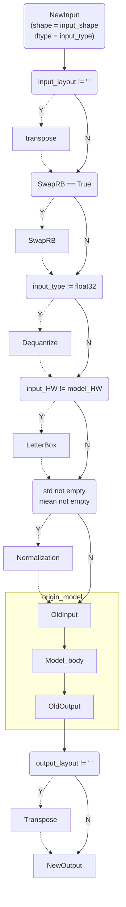
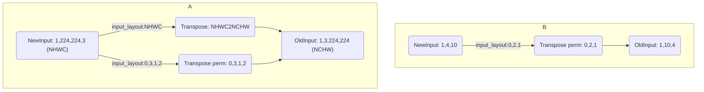
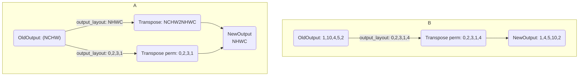

# Overview

`nncase` only provides Python APIs for compiling/inferring deep learning models on x86_64 and amd64 platforms. `nncase-v2` will no longer support k210 and k510 compilation and inference, if needed, please use `nncase-v1` instead.

# nncase-v2 python APIs

## Install

The nncase toolchain compiler section includes the nncase and KPU plugin wheel packages

- nncase and KPU plugin wheel packages are released at [nncase github release](https://github.com/kendryte/nncase/releases)
- nncase-v2 depends on dotnet-7.0.
- User can use `pip` to install nncase and KPU plugin wheel packages under `linux` platform directly, and `apt` to install `dotnet` under Ubuntu environment.

  ```
  pip install --upgrade pip
  pip install nncase
  pip install nncase-kpu

  # nncase-2.x need dotnet-7
  sudo apt-get install -y dotnet-sdk-7.0
  ```
- `Windows` platform support nncase online installation, nncase-kpu need to manually download in [nncase github release](https://github.com/kendryte/nncase/releases) and install.

Users without an Ubuntu environment can use the nncase docker (Ubuntu 20.04 + Python 3.8 + dotnet-7.0).

```shell
$ cd /path/to/nncase_sdk
$ docker pull ghcr.io/kendryte/k230_sdk
$ docker run -it --rm -v `pwd`:/mnt -w /mnt ghcr.io/kendryte/k230_sdk /bin/bash -c "/bin/bash"
```

### Check nncase version

```python
root@469e6a4a9e71:/mnt# python3
Python 3.8.10 (default, May 26 2023, 14:05:08)
[GCC 9.4.0] on linux
Type "help", "copyright", "credits" or "license" for more information.
>>> import _nncase
>>> print(_nncase.__version__)
2.1.0-4a87051
```

## Examples of compilation and inference

Model compilation, inference for k230 can be found in the Jupyter script [User_guide](../examples/user_guide/k230_simulate.ipynb), this script contains single and multiple input examples.

If you run Jupyter scripts in Docker, you can refer to [Configure Jupyter lab](https://github.com/kunjing96/docker-jupyterlab#32-%E9%85%8D%E7%BD%AEjupyter-lab) to configure them.

You need to modify the following to suit your needs before executing the script:

1. Information about `compile_options`, `ptq_options` in `compile_kmodel` function.

   See [CompileOptions](#CompileOptions) for details of `compile_options`.

   See [PTQTensorOptions](#PTQTensorOptions) for details of `ptq_options`.
2. In the `compile kmodel single input (multiple inputs)` section

   Modify `model_path` and `dump_path` to specify the model path and the file generation path during compilation.

   Modify the implementation of `calib_data`, see comments for data format.
3. In the `run kmodel(simulate)` section, modify the implementation of `input_data`, see comments for data format.

At the end of inference, `kmodel`, `output result` and files during compilation are generated under the `dump_path` path.

## The processes of inferring on boards

 Refer to [K230_docs](https://github.com/kendryte/k230_docs/blob/main/zh/01_software/board/ai/K230_nncase_%E5%BC%80%E5%8F%91%E6%8C%87%E5%8D%97.md#4-kpu%E8%BF%90%E8%A1%8C%E6%97%B6apisc).

## compilation APIs

### CompileOptions

#### Parameter Description

CompileOptions is used to configure the nncase compile options

| Attribute       |  Data Type  | Required | Description                                                                                                                                                  |
| :-------------- | :---------: | :------: | ------------------------------------------------------------------------------------------------------------------------------------------------------------ |
| target          |   string   |    Y    | Specify the compile target, such as 'cpu', 'k230'                                                                                                            |
| dump_ir         |    bool    |    N    | Specify whether dump IR, False by default.                                                                                                                   |
| dump_asm        |    bool    |    N    | Specify whether dump asm file, False by default.                                                                                                             |
| dump_dir        |   string   |    N    | Specify dump directory                                                                                                                                       |
| input_file      |   string   |    N    | Specify `.onnx_data` file path when the size of onnx model lager than 2GB.                                                                                 |
|                 |            |          |                                                                                                                                                              |
| preprocess      |    bool    |    N    | Specify whether to enable pre-processing, False by default. The following parameters will work when `preprocess` is True                                   |
| input_type      |   string   |    N    | Specify the input data type when turning on preprocessing, defaults to `float`. When `preprocess` is True, it must be specified as "uint8" or "float32". |
| input_shape     |  list[int]  |    N    | Specify the shape of the input data when turning on preprocessing, [] by default. It must be specified When `preprocess` is `True`                       |
| input_range     | list[float] |    N    | Specify the range of floating-point numbers after inverse quantization of the input data when pre-processing is turned on, [] by default.                    |
| input_layout    |   string   |    N    | Specify the layout of the input data, "" by default.                                                                                                         |
| swapRB          |    bool    |    N    | Specify whether swap the channel of "R,B", False by default.                                                                                                 |
| mean            | list[float] |    N    | Normalize mean value for preprocess, [0, 0, 0] by default                                                                                                    |
| std             | list[float] |    N    | Normalize std value for preprocess, [1, 1, 1] by default                                                                                                     |
| letterbox_value |    float    |    N    | Specify the pad value of letterbox during preprocess, 0 by default.                                                                                          |
| output_layout   |   string   |    N    | Specify the layout of the output data, "" by default.                                                                                                        |

##### The pipeline of preprocessing

At present, there is no support for custom pre-processing order. You can choose the required pre-processing parameters to configure according to the following flow diagram.



Parameter explanations:

1. `input_range` is the range of input data after be dequantized to "float32" when `input_type` is "uint8".

   a. When input type is "uint8",range is "[0,255]",`input_range` is "[0,255]", the Dequantize_op only convert the type of input data to "float32". `mean`and `std` are still specificed according to data with range "[0,255]".

   b.  When input type is "uint8",range is "[0,255]",`input_range` is [0,1],the input data will be dequantized to "float32" with range "[0,1]",`mean`and `std` need to specify according to data with range "[0,1]".

   ```mermaid
   graph TD;
   	NewInput_uint8("NewInput_uint8 \n[input_type:uint8]") --input_range:0,255 -->dequantize_0["Dequantize"]--float range:0,255--> OldInput_float32
   	NewInput_uint81("NewInput_uint8 \n[input_type:uint8]") --input_range:0,1 -->dequantize_1["Dequantize"]--float range:0,1--> OldInput_float32
   ```
2. `input_shape` is the shape of input data,`input_layout` is the layout of input data,Both strings (`"NHWC"`, `"NCHW"`) and indexes are now supported as `input_layout`, and non-4D data handling is supported.

   When `input_layout` is configured in the form of a string, it indicates the layout of the input data; when `input_layout` is configured in the form of an index, it indicates that the input data will be transposed in accordance with the currently configured `input_layout`. `input_layout` is the `perm` parameter of `Transpose`.



    `output_layout` is similar to `input_layout`



#### Example

```python
compile_options = nncase.CompileOptions()

compile_options.target = "cpu" #"k230"
compile_options.dump_ir = True  # if False, will not dump the compile-time result.
compile_options.dump_asm = True
compile_options.dump_dir = "dump_path"
compile_options.input_file = ""

# preprocess args
compile_options.preprocess = False
if compile_options.preprocess:
    compile_options.input_type = "uint8" # "uint8" "float32"
    compile_options.input_shape = [1,224,320,3]
    compile_options.input_range = [0,1]
    compile_options.input_layout = "NHWC" # "NHWC"
    compile_options.swapRB = False
    compile_options.mean = [0,0,0]
    compile_options.std = [1,1,1]
    compile_options.letterbox_value = 0
    compile_options.output_layout = "NHWC" # "NHWC"
```

### ImportOptions

#### Definition

The details of all attributes are following.

| Attribute     | Data Type | *Required* | Description       |
| ------------- | --------- | ------------ | ----------------- |
| output_arrays | string    | N            | output array name |

#### Example

```python
# import_options
import_options = nncase.ImportOptions()
import_options.output_arrays = 'output' # Your output node name
```

### PTQTensorOptions

#### Definition

PTQTensorOptions is used to configure PTQ options. The details of all attributes are following.

| Attribute                             | Data Type | Required | Description                                                                                                         |
| ------------------------------------- | --------- | -------- | ------------------------------------------------------------------------------------------------------------------- |
| calibrate_method                      | string    | N        | Specify calibrate method, 'NoClip' by default. 'Kld' is optional. Must be configured when use quantification.       |
| samples_count                         | int       | N        | The number of calibration data sets. Must be configured when use quantification.                                    |
| finetune_weights_method               | string    | N        | Finetune weights method,'NoFineTuneWeights' by default. 'UseSquant' is optional.                                    |
| quant_type                            | string    | N        | Type of data quantification,'uint8' by default. 'int8','int16' are optional.                                        |
| w_quant_type                          | string    | N        | Type of weights quantification,'uint8' by default. 'int8','int16' are optional.                                     |
|                                       |           |          |                                                                                                                     |
| dump_quant_error                      | bool      | N        | Specify whether dump quantification error, False by default. The parameters following worked when `dump_ir=True`. |
| dump_quant_error_symmetric_for_signed | bool      | N        | Specify whether dump quantification error by symmetric for signed number,True by default.                           |
| quant_scheme                          | string    | N        | specify the path of quantification scheme file,"" by default.                                                       |
| export_quant_scheme                   | bool      | N        | Specify whether export quantification scheme, False by default.                                                     |
| export_weight_range_by_channel        | bool      | N        | Specify whether export weights range by channel, False by default.                                                  |

Detailed information about quantitative profiles can be found at [Mix Quant](MixQuant.md)

#### set_tensor_data()

##### Definition

```python
set_tensor_data(calib_data)
```

##### Parameters

| Attribute  | Data Type | Required | Description               |
| ---------- | --------- | -------- | ------------------------- |
| calib_data | byte[]    | Y        | The data for calibrating. |

##### Returns

N/A

##### Example

```python
# If model has multiple inputs, calib_data format is "[[x1, x2,...], [y1, y2,...], ...]"
# e.g. Model has three inputs (x, y, z), the calib_data is '[[x1, x2, x3],[y1, y2, y3],[z1, z2, z3]]'

calib_data = [[np.random.rand(1, 3, 224, 224).astype(np.float32), np.random.rand(1, 3, 224, 224).astype(np.float32)]]

# ptq_options
ptq_options = nncase.PTQTensorOptions()
ptq_options.samples_count = len(calib_data[0])
ptq_options.set_tensor_data(calib_data)
```

### Compiler

#### Description

Compiler is used to compile models.

#### Example

```python
compiler = nncase.Compiler(compile_options)
```

#### import_tflite()

##### Description

Import tflite model.

##### Definition

```python
import_tflite(model_content, import_options)
```

##### Parameters

| Attribute      | Data Type     | Required | Description           |
| -------------- | ------------- | -------- | --------------------- |
| model_content  | byte[]        | Y        | The content of model. |
| import_options | ImportOptions | Y        | Import options        |

##### Returns

N/A

##### Example

```python
model_content = read_model_file(model)
compiler.import_tflite(model_content, import_options)
```

#### import_onnx()

##### Description

Import onnx model.

##### Definition

```python
import_onnx(model_content, import_options)
```

##### Parameters

| Attribute      | Data Type     | Required | Description           |
| -------------- | ------------- | -------- | --------------------- |
| model_content  | byte[]        | Y        | The content of model. |
| import_options | ImportOptions | Y        | Import options        |

##### Returns

N/A

##### Example

```python
model_content = read_model_file(model)
compiler.import_onnx(model_content, import_options)
```

#### use_ptq()

##### Description

Enable PTQ.

##### Definition

```python
use_ptq(ptq_options)
```

##### Parameters

| Attribute   | Data Type        | Required | Description  |
| ----------- | ---------------- | -------- | ------------ |
| ptq_options | PTQTensorOptions | Y        | PTQ options. |

##### Returns

N/A

##### Example

```python
compiler.use_ptq(ptq_options)
```

#### compile()

##### Description

Compile model.

##### Definition

```python
compile()
```

##### Parameters

N/A

##### Returns

N/A

##### Example

```python
compiler.compile()
```

#### gencode_tobytes()

##### Description

Generate byte code for model.

##### Definition

```python
gencode_tobytes()
```

##### Parameters

N/A

##### Returns

bytes[]

##### Example

```python
kmodel = compiler.gencode_tobytes()
with open(os.path.join(infer_dir, 'test.kmodel'), 'wb') as f:
    f.write(kmodel)
```

## nncase inference APIs

Nncase provides inference APIs to inference kmodel. You can make use of it to check the result with runtime for deep learning frameworks.

### MemoryRange

#### Description

MemoryRange is used to describe the range to memory.

| Attribute | Data Type        | Required | Description                                                                                                      |
| --------- | ---------------- | -------- | ---------------------------------------------------------------------------------------------------------------- |
| location  | int              | N        | Specify the location of memory. 0 means input, 1 means output, 2 means rdata, 3 means data, 4 means shared_data. |
| dtype     | python data type | N        | data type                                                                                                        |
| start     | int              | N        | The start of memory                                                                                              |
| size      | int              | N        | The size of memory                                                                                               |

#### Example

```python
mr = nncase.MemoryRange()
```

### RuntimeTensor

#### Description

RuntimeTensor is used to describe the runtime tensor. The details of all attributes are following.

| Attribute | Data Type | Required | Description             |
| --------- | --------- | -------- | ----------------------- |
| dtype     | int       | N        | The data type of tensor |
| shape     | list      | N        | The shape of tensor     |

#### from_numpy()

##### Description

Construct RuntimeTensor from numpy.ndarray

##### Definition

```python
from_numpy(py::array arr)
```

##### Parameters

| Attribute | Data Type     | Required | Description   |
| --------- | ------------- | -------- | ------------- |
| arr       | numpy.ndarray | Y        | numpy.ndarray |

##### Returns

RuntimeTensor

##### Example

```python
tensor = nncase.RuntimeTensor.from_numpy(self.inputs[i]['data'])
```

#### copy_to()

##### Description

Copy RuntimeTensor

##### Definition

```python
copy_to(RuntimeTensor to)
```

##### Parameters

| Attribute | Data Type     | Required | Description   |
| --------- | ------------- | -------- | ------------- |
| to        | RuntimeTensor | Y        | RuntimeTensor |

##### Returns

N/A

##### Example

```python
sim.get_output_tensor(i).copy_to(to)
```

#### to_numpy()

##### Description

Convert RuntimeTensor to numpy.ndarray.

##### Definition

```python
to_numpy()
```

##### Parameters

N/A

##### Returns

numpy.ndarray

##### Example

```python
arr = sim.get_output_tensor(i).to_numpy()
```

### Simulator

#### Description

Simulator is used to inference kmodel on PC. The details of all attributes are following.

| Attribute    | Data Type | Required | Description            |
| ------------ | --------- | -------- | ---------------------- |
| inputs_size  | int       | N        | The number of inputs.  |
| outputs_size | int       | N        | The number of outputs. |

#### Example

```python
sim = nncase.Simulator()
```

#### load_model()

##### Description

Load kmodel.

##### Definition

```python
load_model(model_content)
```

##### Parameters

| Attribute     | Data Type | Required | Description        |
| ------------- | --------- | -------- | ------------------ |
| model_content | byte[]    | Y        | kmodel byte stream |

##### Returns

N/A

##### Example

```python
sim.load_model(kmodel)
```

#### get_input_desc()

##### Description

Get description for input.

##### Definition

```python
get_input_desc(index)
```

##### Parameters

| Attribute | Data Type | Required | Description          |
| --------- | --------- | -------- | -------------------- |
| index     | int       | Y        | The index for input. |

##### Returns

MemoryRange

##### Example

```python
input_desc_0 = sim.get_input_desc(0)
```

#### get_output_desc()

##### Description

Get description for output.

##### Definition

```python
get_output_desc(index)
```

##### Parameters

| Attribute | Data Type | Required | Description           |
| --------- | --------- | -------- | --------------------- |
| index     | int       | Y        | The index for output. |

##### Returns

MemoryRange

##### Example

```python
output_desc_0 = sim.get_output_desc(0)
```

#### get_input_tensor()

##### Description

Get the input runtime tensor with specified index.

##### Definition

```python
get_input_tensor(index)
```

##### Parameters

| Attribute | Data Type | Required | Description                 |
| --------- | --------- | -------- | --------------------------- |
| index     | int       | Y        | The index for input tensor. |

##### Returns

RuntimeTensor

##### Example

```python
input_tensor_0 = sim.get_input_tensor(0)
```

#### set_input_tensor()

##### Description

Set the input runtime tensor with specified index.

##### Definition

```python
set_input_tensor(index, tensor)
```

##### Parameters

| Attribute | Data Type     | Required | Description                 |
| --------- | ------------- | -------- | --------------------------- |
| index     | int           | Y        | The index for input tensor. |
| tensor    | RuntimeTensor | Y        | RuntimeTensor               |

##### Returns

N/A

##### Example

```python
sim.set_input_tensor(0, nncase.RuntimeTensor.from_numpy(self.inputs[0]['data']))
```

#### get_output_tensor()

##### Description

Get the output runtime tensor with specified index.

##### Definition

```python
get_output_tensor(index)
```

##### Parameters

| Attribute | Data Type | Required | Description                  |
| --------- | --------- | -------- | ---------------------------- |
| index     | int       | Y        | The index for output tensor. |

##### Returns

RuntimeTensor

##### Example

```python
output_arr_0 = sim.get_output_tensor(0).to_numpy()
```

#### set_output_tensor()

##### Description

Set the RuntimeTensor with specified index.

##### Definition

```python
set_output_tensor(index, tensor)
```

##### Parameters

| Attribute | Data Type     | Required | Description                  |
| --------- | ------------- | -------- | ---------------------------- |
| index     | int           | Y        | The index for output tensor. |
| tensor    | RuntimeTensor | Y        | RuntimeTensor                |

##### Returns

N/A

##### Example

```python
sim.set_output_tensor(0, tensor)
```

#### run()

##### Description

Run kmodel for inferencing.

##### Definition

```python
run()
```

##### Parameters

N/A

##### Returns

N/A

##### Example

```python
sim.run()
```
