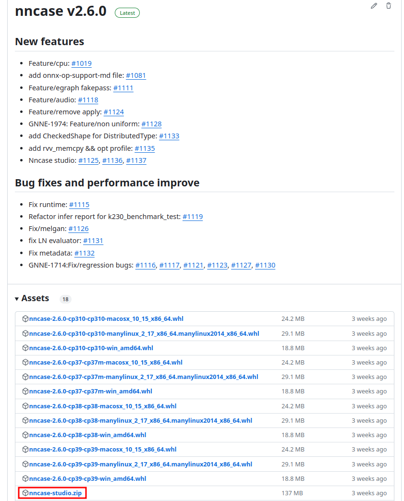

# 下载

nncase studio的版本和nncase的版本是一致的，后续studio的更新都会放在每个版本的release的asset中，如果需要下载最新的可以通过这里看到最新的release版本，在assets中找到对应的下载链接

以2.6.0为例

你可以在这个链接找到最新的release的asset

https://github.com/kendryte/nncase/releases

下载压缩包后进行解压， 找到文件夹中的Nncase.Studio文件，双击或者在当前目录下的命令行输入./Nncase.Studio即可启动

# 编译配置

启动nncase studio后，会看到如下初始界面。

界面中有三个主要的按钮

1. 当第一次打开的时候需要直接选择**常规编译**
2. 如果已经有了kmodel和输入文件，那么只需要**直接推理**即可
3. 如果之前下方的导出编译配置导出过配置文件，那么可以通过**导入配置**按钮加载以往的配置。整个过程中随时可以通过下方的导出编译配置保存配置文件，下次即可在这里直接通过配置文件加载所有已修改的条目。

这里我们是第一次编译，因此单击常规编译，进入到下一个页面

目前nncase支持ncnn，onnx，tflite三种模型的格式，我们在这里点击import，即可打开窗口选择对应的模型，点击Open即可导入对应的模型文件

之后会自动进入到一些基础编译选项的配置页面。这个页面以及之后页面的配置填写的方式几乎都与命令行相同，比如说字符串的格式，或者字段具体的含义后面不再每次都重复说明，如有疑问可以参考以下链接

[https://github.com/kendryte/nncase/blob/master/docs/USAGE_v2.md](https://github.com/kendryte/nncase/blob/master/docs/USAGE_v2.md)

如果要配置dump选项，那么单击红框中的按钮，在显示的下拉菜单中选中所需要dump的信息，可以进行多选，不同的选项包含了不同阶段生成的信息，根据情况选择，如果你不需要查看生成的信息，也可以忽略这个选项，不影响正常的流程。

dump路径默认会设置为当前可执行程序所在的位置下的nncase_dump文件夹，比如我这里的可执行程序的路径在/home/homura/Downloads/nncase-studio/，对应的dump路径为/home/homura/Downloads/nncase-studio/nncase-dump，可自行修改为自己想要的路径

根据需求设置开启 前后处理 / 量化 / ShapeBucket，这几个选项会在后面显示不同的页面，如果不开启选项则会跳过对应页面。设置好之后点击下一步进入下一个页面。

# 前后处理

如果你开启了前后处理，那么就会进入到以下这个界面

layout和命令行的输入是一致的，支持NCHW的格式，也同样数字0231的格式。

InputShape则是用逗号隔开的维度信息。

配置好对应参数后即可点击下一步切换到下一个页面。

关于前处理的顺序，可以通过单击显示前处理顺序来看到整个的流程，目前只支持固定的前后处理。

# 量化

## 非混合量化

如果开启量化，那么前后处理后下一个界面是量化的配置。如果不使用混合量化，则会进入当前这个界面。

首先是数选择数据集所在的文件夹。输入的数据需要有datatype和shape的信息，因此数据集中目前仅支持npy格式的输入文件。

另外放入数据集中的矫正集需要按照特定的文件名格式，用于正确的解析文件。

格式为”第几组数据集_第几个输入_文件名.bin“的格式，多组文件都放在同一个文件夹之中，例如下图中

## 混合量化

如果使用混合量化，那么会进入这样的界面。

混合量化的配置基本上是通过nncase导出的，但也有来自内部其他工具导出的配置，这里只需要选择对应的json文件即可。

量化相关的配置设置好后单击下一步。

# ShapeBucket

在ShapeBucket中和在命令行中填写的信息类似，只不过这里要转成字符串的形式。FixVarMap和VarRangeInfo都通过逗号隔开多个参数，其中每一个参数的具体写法如图中的浅色字体所示。

当一切都填写好后即可点击下一步。

# Compile

默认的kmodel路径会在之前填写的dump目录下，也可以自行输入一个自己想要的路径，设置好kmodel路径后就可以开始编译了，开始编译后如果有什么问题随时可以通过停止按钮立刻结束编译的过程。如果没什么问题，在编译完成后会弹出窗口提示已完成会显示最后生成的kmodel路径，可选中进行复制对应的路径，另外会自动跳转到下一个页面。

# Simulate

进行推理之前需要配置输入文件，以及结果存储的位置（默认会存储到dump的文件夹下）。选择输入文件的时候需要配置文件名的格式以编号下划线开头，否则会导致无法对应到正确的输入中。

点击这个按钮可以看到当前已经添加的输入文件

设置好所有的路径后即可开始推理，目前只支持在simulator上进行推理。点击开始推理后可能需要等一会，simulator会模拟硬件的行为，不可能像上板一样秒出结果，在推理的过程会有滚动的进度条以及计时。

推理成功后会弹出这样的一个窗口，此时所有的输出已经写入到对应的结果保存的路径中，文件名为nncase_result_*.npy

对应的dump文件夹中即可看到所有产生的文件，包括dump的文件，kmodel以及生成的结果文件。

