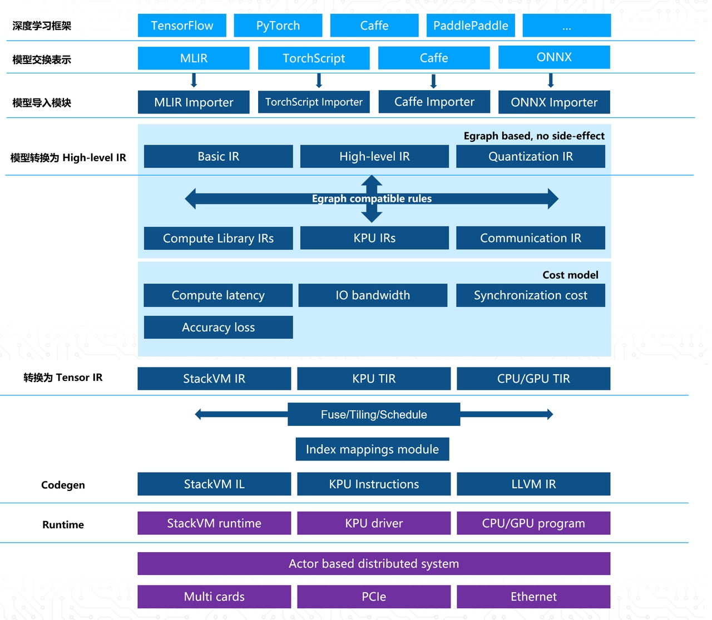

<div align="center">

</div>

[](https://github.com/kendryte/nncase) [](https://gitee.com/kendryte/nncase) [](https://github.com/kendryte/nncase/releases)

[Switch to English](../README.md)

`nncase` 是一个为 AI 加速器设计的神经网络编译器。
技术交流 QQ 群：790699378 答案：人工智能
Telegram: [nncase community](https://t.me/joinchat/PPcEPZMLaTViNDI1)

[TOC]

---

## K230

- [使用说明](./USAGE_v2.md)
- [常见问题](./FAQ_ZH.md)
- [示例](../examples/user_guide/k230_simulate-ZH.ipynb)
- [Colab 在线示例](https://colab.research.google.com/drive/1m8TTree096m5VHmq-Uc60gXyltVCgnRb?usp=sharing)
- [ *nncase与K230_SDK版本对应关系说明* ](https://developer.canaan-creative.com/k230/dev/zh/03_other/K230_SDK_nncase%E7%89%88%E6%9C%AC%E5%AF%B9%E5%BA%94%E5%85%B3%E7%B3%BB.html#k230sdknncase)
- [SDK中更新nncase运行时库](https://developer.canaan-creative.com/k230/dev/zh/03_other/K230_SDK%E6%9B%B4%E6%96%B0nncase%E8%BF%90%E8%A1%8C%E6%97%B6%E5%BA%93%E6%8C%87%E5%8D%97.html)


### 安装

- Linux：

    ```shell
    pip install nncase nncase-kpu
    ```

- Windows:

    ```shell
    1. pip install nncase
    2. 在下面release链接中下载`nncase_kpu-2.x.x-py2.py3-none-win_amd64.whl`
    3. pip install nncase_kpu-2.x.x-py2.py3-none-win_amd64.whl
    ```

已经发布Python包见[Release](https://github.com/kendryte/nncase/releases)页面。

### 支持的算子

- [TFLite ops](https://github.com/kendryte/nncase/blob/release/2.0/docs/tflite_ops.md)
- [Caffe ops](https://github.com/kendryte/nncase/blob/release/2.0/docs/caffe_ops.md)
- [ONNX ops](https://github.com/kendryte/nncase/blob/release/2.0/docs/onnx_ops.md)

### benchmark test

<table>
<tr> <th>kind</th> <th> model             </th><th> shape         </th><th> quant_type(If/W) </th><th> nncase_fps    </th><th> tflite_onnx_result    </th><th> accuracy </th><th> info  </th></tr>
<tr>
<td rowspan='3'>Image Classification</td>
<td>mobilenetv2        </td><td> [1,224,224,3] </td><td> u8/u8            </td><td> 600.24        </td><td>  top-1 = 71.3%<br/>top-5 = 90.1%  </td><td> top-1 = 71.1%<br/>top-5 = 90.0% </td><td> dataset(ImageNet 2012, 50000 images)<br/> tflite </td></tr>
<tr><td>resnet50V2         </td><td> [1,3,224,224] </td><td> u8/u8            </td><td> 86.17         </td><td>  top-1 = 75.44%<br/>top-5 = 92.56%  </td><td> top-1 = 75.11% <br/> top-5 = 92.36% </td><td> dataset(ImageNet 2012, 50000 images)<br/> onnx</td></tr>
<tr><td>yolov8s_cls        </td><td> [1,3,224,224] </td><td> u8/u8            </td><td> 130.497       </td><td>  top-1 = 72.2%<br/>top-5 = 90.9% </td><td> top-1 = 72.2%<br/>top-5 = 90.8% </td><td> dataset(ImageNet 2012, 50000 images)<br/> yolov8s_cls(v8.0.207)</td></tr>
<tr>
<td rowspan='2'>Object Detection</td>
<td>yolov5s_det        </td><td> [1,3,640,640] </td><td> u8/u8            </td><td> 23.645        </td><td>  bbox<br/>mAP50-90 = 0.374<br/>mAP50 = 0.567  </td><td> bbox<br/>mAP50-90 = 0.369<br/>mAP50 = 0.566</td><td>dataset(coco val2017, 5000 images)<br/>yolov5s_det(v7.0 tag, rect=False, conf=0.001, iou=0.65)</td></tr>
<tr><td>yolov8s_det        </td><td> [1,3,640,640] </td><td> u8/u8            </td><td> 9.373         </td><td>  bbox<br/>mAP50-90 = 0.446<br/>mAP50 = 0.612<br/>mAP75 = 0.484  </td><td> bbox<br/>mAP50-90 = 0.404<br/>mAP50 = 0.593<br/>mAP75 = 0.45</td><td>dataset(coco val2017, 5000 images)<br/>yolov8s_det(v8.0.207, rect = False)</td></tr>
<tr>
<td rowspan='1'>Image Segmentation</td>
<td>yolov8s_seg        </td><td> [1,3,640,640] </td><td> u8/u8            </td><td> 7.845         </td><td>  bbox<br/>mAP50-90 = 0.444<br/>mAP50 = 0.606<br/>mAP75 = 0.484<br/>segm<br/>mAP50-90 = 0.371<br/>mAP50 = 0.578<br/>mAP75 = 0.396       </td><td> bbox<br/>mAP50-90 = 0.444<br/>mAP50 = 0.606<br/>mAP75 = 0.484<br/>segm<br/>mAP50-90 = 0.371<br/>mAP50 = 0.579<br/>mAP75 = 0.397</td><td> dataset(coco val2017, 5000 images)<br/>yolov8s_seg(v8.0.207, rect = False, conf_thres = 0.0008)</td></tr>
<tr>
<td rowspan='3'>Pose Estimation</td>
<td>yolov8n_pose_320   </td><td> [1,3,320,320] </td><td> u8/u8            </td><td> 36.066        </td><td>  bbox<br/>mAP50-90 = 0.6<br/>mAP50 = 0.843<br/>mAP75 = 0.654<br/>keypoints<br/>mAP50-90 = 0.358<br/>mAP50 = 0.646<br/>mAP75 = 0.353    </td><td> bbox<br/>mAP50-90 = 0.6<br/>mAP50 = 0.841<br/>mAP75 = 0.656<br/>keypoints<br/>mAP50-90 = 0.359<br/>mAP50 = 0.648<br/>mAP75 = 0.357 </td><td> dataset(coco val2017, 2346 images)<br/>yolov8n_pose(v8.0.207, rect = False)</td></tr>
<tr><td>yolov8n_pose_640   </td><td> [1,3,640,640] </td><td> u8/u8            </td><td> 10.88         </td><td>  bbox<br/>mAP50-90 = 0.694<br/>mAP50 = 0.909<br/>mAP75 = 0.776<br/>keypoints<br/>mAP50-90 = 0.509<br/>mAP50 = 0.798<br/>mAP75 = 0.544  </td><td> bbox<br/>mAP50-90 = 0.694<br/>mAP50 = 0.909<br/>mAP75 = 0.777<br/>keypoints<br/>mAP50-90 = 0.508<br/>mAP50 = 0.798<br/>mAP75 = 0.54 </td><td> dataset(coco val2017, 2346 images)<br/>yolov8n_pose(v8.0.207, rect = False)</td></tr>
<tr><td>yolov8s_pose       </td><td> [1,3,640,640] </td><td> u8/u8            </td><td> 5.568         </td><td>  bbox<br/>mAP50-90 = 0.733<br/>mAP50 = 0.925<br/>mAP75 = 0.818<br/>keypoints<br/>mAP50-90 = 0.605<br/>mAP50 = 0.857<br/>mAP75 = 0.666  </td><td> bbox<br/>mAP50-90 = 0.734<br/>mAP50 = 0.925<br/>mAP75 = 0.819<br/>keypoints<br/>mAP50-90 = 0.604<br/>mAP50 = 0.859<br/>mAP75 = 0.669</td><td> dataset(coco val2017, 2346 images)<br/>yolov8s_pose(v8.0.207, rect = False)</td></tr>
</table>


### Demo示例

|[eye gaze](https://developer.canaan-creative.com/devAdmin/model/download?mid=be978f1f38b8aa2f2b649185a10c2e9c&filePath=/upload/model/official/k230/yolop_lane_seg/yolop_lane_seg.zip)  | [space_resize](https://developer.canaan-creative.com/devAdmin/model/download?mid=7d48cb68a499dd54daf0ced14549b142&filePath=/upload/model/official/k230/space_resize/space_resize.zip) | [face pose](https://developer.canaan-creative.com/devAdmin/model/download?mid=5b87c02b969a9e60d48b08e357c20e31&filePath=/upload/model/official/k230/face_pose/face_pose.zip) |
|---|---|---|
| | | |

---

## K210/K510

- [使用说明](https://github.com/kendryte/nncase/blob/release/1.0/docs/USAGE_ZH.md)
- [常见问题](https://github.com/kendryte/nncase/blob/release/1.0/docs/FAQ_ZH.md)
- [示例程序](https://github.com/kendryte/nncase/blob/release/1.0/examples/user_guide/)

### 支持的算子

- [TFLite ops](https://github.com/kendryte/nncase/blob/release/1.0/docs/tflite_ops.md)
- [Caffe ops](https://github.com/kendryte/nncase/blob/release/1.0/docs/caffe_ops.md)
- [ONNX ops](https://github.com/kendryte/nncase/blob/release/1.0/docs/onnx_ops.md)

---

## 特性

- 支持多输入输出网络，支持多分支结构
- 静态内存分配，不需要堆内存
- 算子合并和优化
- 支持 float 和量化 uint8 推理
- 支持训练后量化，使用浮点模型和量化校准集
- 平坦模型，支持零拷贝加载

---

## 架构

<div align="center">

</div>

---

## 源码编译

**推荐直接通过`pip`安装nncase来使用，目前K510、K230芯片相关的源码并未开源，因此无法直接通过编译源码来使用`nncase-k510`和`nncase-kpu`(K230)。**

如果你的模型中存在`nncase`尚未支持的算子，可以在issue中提出需求，或者自己实现并提交PR。后续版本将会进行集成，或者联系我们提供临时版本。
以下为编译 `nncase` 的步骤

```shell
git clone https://github.com/kendryte/nncase.git
cd nncase
mkdir build && cd build

# 使用Ninja编译
cmake .. -G Ninja -DCMAKE_BUILD_TYPE=Release -DCMAKE_INSTALL_PREFIX=./install
ninja && ninja install

# 使用make编译
cmake .. -DCMAKE_BUILD_TYPE=Release -DCMAKE_INSTALL_PREFIX=./install
make && make install
```

---

## 资源

### 嘉楠开发者社区

[嘉楠开发者社区](https://developer.canaan-creative.com/resource)中包含所有K210、K510、K230相关的资源，包括：
- 资料下载 --> 三款芯片对应的开发板可使用的预编译镜像。
- 文档 --> 三款芯片及不同版本对应的文档。
- 模型库 --> K210、K230上可运行的应用于工业、安防、教育等场景的示例以及代码。
- 模型训练 --> 针对K210、K230的模型训练平台，支持多种场景的训练。

### Bilibili
- [嘉楠 AI教程及应用演示](https://space.bilibili.com/677429436)

### K210相关仓库

- [K210_Yolo_framework](https://github.com/zhen8838/K210_Yolo_framework)
- [Shts!&#39;s Blog (Japanese)](https://www.shtsno24.tokyo/2020/03/nncase-v020.html)
- [示例脚本](https://github.com/kendryte/canmv_examples/tree/main/01-K210)

### K230相关仓库

- C: [K230_SDK](https://github.com/kendryte/k230_sdk)
    - [文档](https://github.com/kendryte/k230_docs)
    - [K230端到端全流程教程](https://github.com/kendryte/K230_training_scripts)
- MicroPython: [Canmv_k230](https://github.com/kendryte/k230_canmv)
    - [文档](https://github.com/kendryte/k230_canmv_docs)
    - [示例脚本](https://github.com/kendryte/canmv_examples/tree/main/02-K230)