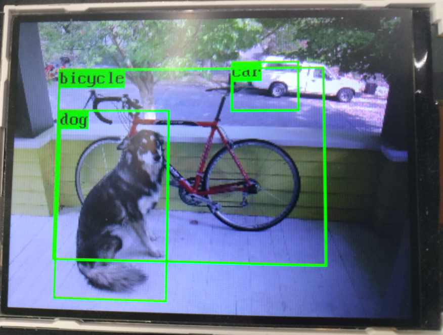

# 20 Classes Object Detection
## Usage
1. Download `nncase` from [Release](https://github.com/kendryte/nncase/releases) and extract `ncc-linux-x86_64.tar.xz` to `~/nncase`.
```bash
mkdir ~/nncase
tar xf ncc-linux-x86_64.tar.xz -C ~/nncase
```
2. Convert your image to c by `image2c.py`.
```bash
python img2c.py dog.bmp
```
3. Compile your tflite model to kmodel.
```bash
~/nncase/ncc -i tflite -o k210model --channelwise-output --dataset images model/20classes_yolo.tflite k210/kpu_20classes_example/yolo.kmodel
```
4. Compile your program and run.
```bash
cmake .. -DPROJ=kpu_20classes_example
make
python3 kflash.py -t kpu_20classes_example.bin
```
## Result
