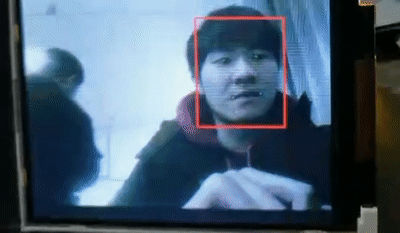

# ULFFD with Landmark
## Usage
1. Download `nncase` from [Release v0.2.0 Beta1](https://github.com/kendryte/nncase/releases) and extract `ncc-linux-x86_64.tar.xz` to `~/nncase`.
```bash
mkdir ~/nncase
tar xf ncc-linux-x86_64.tar.xz -C ~/nncase
```
2. Compile your tflite model to kmodel.

```bash
cd examples/facedetect_landmark
~/nncase/ncc compile model/ulffd_landmark.tflite k210/facedetect_landmark_example/ulffd_landmark.kmodel -i tflite --dataset images --input-std 1 --input-mean 0.5
```

3. Compile your program and run.
Link to your KD233 development board.
**NOTE** SDK version needs to be greater than [kendryte-standalone-sdk-develop](https://github.com/kendryte/kendryte-standalone-sdk/tree/develop) `2a145b0cacd7123616232ae15ead826d8a83771b`
```bash
cmake .. -DPROJ=facedetect_landmark_example
make
kflash facedetect_landmark_example.bin -B kd233 -p /dev/ttyUSB0 -b 2000000 -t
```
## Result


## Credits
[Ultra-Light-Fast-Generic-Face-Detector-1MB](https://github.com/Linzaer/Ultra-Light-Fast-Generic-Face-Detector-1MB)
[RetinaFace](https://github.com/deepinsight/insightface/tree/master/RetinaFace)