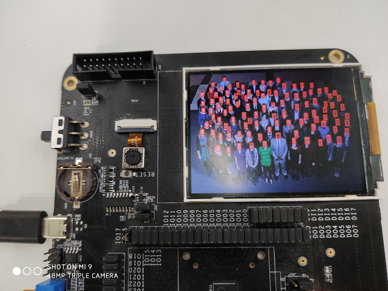

# Ultra-Light-Fast-Generic-Face-Detector-1MB
## Usage
1. Download `nncase` from [Release](https://github.com/kendryte/nncase/releases) and extract `ncc-linux-x86_64.tar.xz` to `~/nncase`.
```bash
mkdir ~/nncase
tar xf ncc-linux-x86_64.tar.xz -C ~/nncase
```
2. Convert your image to c by `image2c.py`.
```bash
python img2c.py face.jpg
```
3. Compile your caffe model to kmodel.
```bash
~/nncase/ncc compile model/slim-320.caffemodel k210/kpu_fast_facedetect_example/slim-320.kmodel -i caffe -o kmodel -t k210 --dataset images
```
4. Compile your program and run.
Link to your KD233 development board.
```bash
cmake .. -DPROJ=kpu_fast_facedetect_example
make
python3 kflash.py -t kpu_fast_facedetect_example.bin
```
## Result
Model|Inference Latency(ms)
------|--------
[slim-320](https://github.com/kendryte/nncase/tree/master/examples/fast_facedetect/k210/kpu_fast_facedetect_example/slim-320.kmodel)|65.6
[RFB-320](https://github.com/kendryte/nncase/tree/master/examples/fast_facedetect/k210/kpu_fast_facedetect_example/RFB-320.kmodel)|164.8



## Credits
[Ultra-Light-Fast-Generic-Face-Detector-1MB](https://github.com/Linzaer/Ultra-Light-Fast-Generic-Face-Detector-1MB)