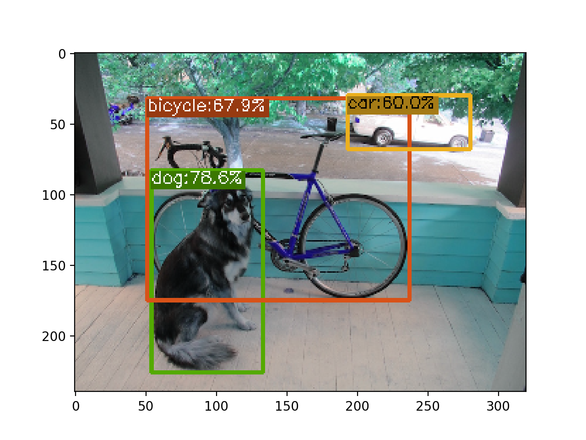
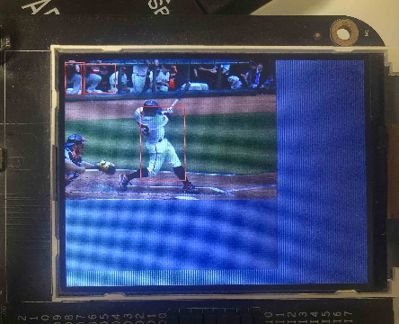

# 可改进项

1. nncase部分
   -  [ ] 将`YoloV5Focus`适配到`kpu`进行处理
   -  [x] 支持`by channel`量化

2. 模型部分
   -  [ ] 减少输出类别
   -  [ ] 将`k=5,5;9,9;13,13`的三个`pooling`层替换为`kpu`支持的层

# yolox多尺度推理效果体验

我们可以测试`yolox`的网络具备相当强大的多尺度预测能力,在缩小模型输入的情况下依旧可以正常识别(此脚本位于`yolox`项目中):
```bash
python tools/demo.py image -n yolox-nano -c yolox_nano.pth --path assets/dog.jpg --conf 0.25 --nms 0.45 --tsize 224 --save_result --device cpu
```

# 模型编译

## 导出onnx模型

虽然`k210`的`kpu`内存有限且摄像头采集图像大小有限,不过`yolox`的多尺度能力能最大限度的避免以上问题,我们导出输入为`224,224`的`onnx`模型也可以得到不错的精度(此脚本位于`yolox`项目中):

📝 运行前请注释`yolox/exp/base_exp.py`的`71-73`行.

```bash
python tools/export_onnx.py --output-name yolox_nano_224.onnx -f exps/default/nano.py  -c yolox_nano.pth  test_size "(224,224)" 
```

****
# 编译模型与测试 

## 1. 编译浮点模型与验证:

使用[nncase](https://github.com/kendryte/nncase/tree/master)神经网络编译器对`onnx`模型进行编译优化、后训练量化得到适用于边缘计算的`kmodel`格式模型:

我们可以在[nncase release](https://github.com/kendryte/nncase/releases)页面下载合适自己平台的`wheel`包,使用`pip`安装之后执行我提供的脚本进行模型编译与推理:

```sh
python tools/compile.py model/yolox_nano_224.onnx yolox_nano_224.kmodel --legacy
python tools/simulate.py yolox_nano_224.kmodel ../20classes_yolo/images/dog.bmp
```



## 2. 编译定点模型与验证:

- 编译cpu所使用的定点模型:

```sh
cd examples/yolox
python tools/compile.py model/yolox_nano_224.onnx yolox_nano_224_quant.kmodel --imgs_dir ../20classes_yolo/images/ --legacy
python tools/simulate.py yolox_nano_224_quant.kmodel ../20classes_yolo/images/dog.bmp
```

-  编译k210所使用的定点模型
```sh
cd examples/yolox
python tools/compile.py model/yolox_nano_224.onnx yolox_nano_224_quant.kmodel --imgs_dir ../20classes_yolo/images/ --legacy --target k210
python tools/simulate.py yolox_nano_224_quant.kmodel ../20classes_yolo/images/dog.bmp
```

# K210端测试

## 生成静态图像用于测试

我在`simulate.py`中添加了自动导出测试图像`bin`的功能,此时导出的`bin`文件即可用于测试.

将编译生成的`yolox_nano_224_quant.kmodel`与`xxx.bin`移动到`/k210/yolox_detect_example`目录以作测试:
```sh
mv yolox_nano_224_quant.kmodel k210/yolox_detect_example/yolox_nano_224.kmodel
mv xxx.bin k210/yolox_detect_example/input.bin
```

## 浮点模型推理测试

`yolox nano`全浮点模型还是略大于k210的内存,因此无法加载.

## 定点模型推理测试

使用git clone的develop分支的[裸机sdk](https://github.com/kendryte/kendryte-standalone-sdk/tree/develop),将`yolox_detect_example`拷贝到`src`目录下.

如果您目前使用的nncase版本大于1.0.0, 请参考[这里](https://github.com/kendryte/nncase/blob/master/docs/USAGE_ZH.md#部署-nncase-runtime)更新sdk中对应的nncase runtime版本(runtime版本需要与自身所使用的nncase版本相匹配).

按照如下命令编译与烧录(请参考裸机sdk使用指南,首先配置好工具链等相关环境)
```bash
mkdir build && cd build
cmake .. -DPROJ=yolox_detect_example -DTOOLCHAIN=/usr/local/opt/kendryte-toolchain/bin
make -j
kflash yolox_detect_example.bin -B kd233 -p /dev/cu.usbserial-1130 -b 2000000 -t
```

⚠️不同的电脑上usb端口号并不一致.

⚠️使用example中提供的kmodel时无需更新runtime.

可能的结果:


# 致谢
[YOLOX](https://github.com/Megvii-BaseDetection/YOLOX)
